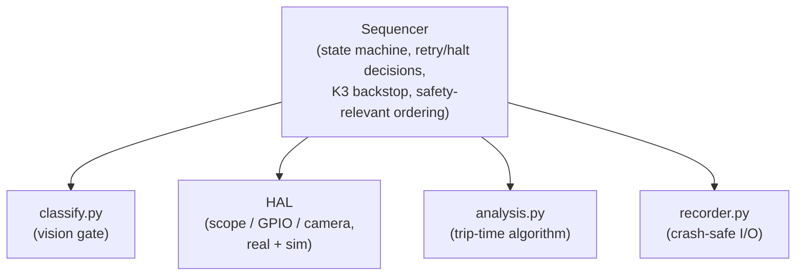
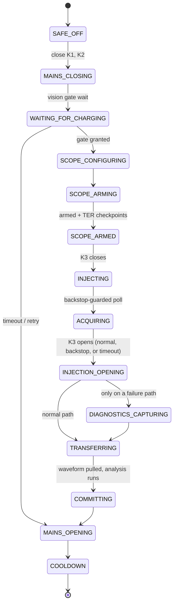
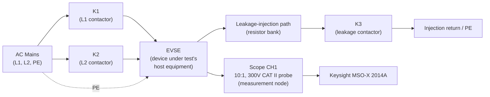
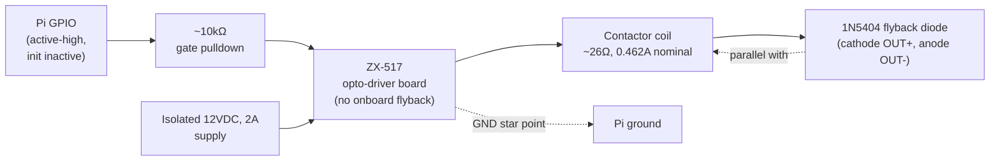

# Project A.M.P.E.R.E.
## Automated Measurement of Parasitic Electrical Responses and Events
### System Design and Validation

## Executive Summary

Charge Circuit Interrupting Devices (CCIDs) are the ground-fault protective element inside electric vehicle supply equipment (EVSE). A CCID must clear a leakage fault within a bounded time, and confidence in that behavior requires exercising a device across thousands of repeated fault cycles rather than trusting a single measurement. Project A.M.P.E.R.E. is a Raspberry Pi-driven test rig that injects a controlled ground fault into a live EVSE, captures the resulting transient on a digital oscilloscope, verifies via machine vision that the fault was injected only while the EVSE was genuinely charging, and records every cycle's raw waveform and verdict to a crash-safe, resumable data store — unattended, for campaigns of up to 6,000 cycles.

This report specifies the system's requirements, electrical and software architecture, measurement methodology (including the specific algorithms used to convert a raw waveform into a trip-time verdict), and the commissioning process that validated the rig before it was trusted to run unattended. Three real, hardware-adjacent investigations shaped the current design — an oscilloscope trigger failure whose root cause turned out to be a software state-tracking bug, two redesigns of the vision charging-gate logic, and an auto-retry/equipment-refresh capability built after unattended campaigns kept stopping on transient halts — each is summarized in §9.3 with a pointer to the full chronological record in `docs/`.

The system was validated through this process and subsequently ran a 6,000-cycle endurance campaign, reported separately in Addendum I. This report does not present campaign results, and it does not constitute a UL 2231-2 certification record — the measurement endpoint definition is this project's own provisional interpretation, pending confirmation against the published standard (§9's requirements matrix and §10 state this precisely rather than glossing over it).

## 1. Purpose, Scope, and Claims

A ground-fault circuit interrupter protecting EV charging equipment has one job that matters above all others: when a leakage fault occurs, it must interrupt the circuit within a bounded time. UL 2231-2 is the governing standard, and proving compliance is not a one-time measurement — it requires exercising the device across many repeated fault events and confirming its response stays consistently within bounds, cycle after cycle, without an occasional slow response hiding in the tail of the distribution. Doing that manually does not scale: each cycle requires safely energizing the rig, injecting a fault at a known point in time, capturing a fast transient with the right trigger and timebase settings, reading the result, and safely de-energizing again. A human operator can do this a handful of times per session; a meaningful reliability claim requires thousands of cycles run back to back over days. That gap is why this system exists.

**Scope of this document.** §3 defines what the system must do, in testable form. §4 covers the physical/electrical architecture, instrumentation, software architecture, and where safety enforcement actually lives. §5 covers the operating sequence. §6 covers the measurement methodology: how trip time is defined, how the analysis algorithm turns a waveform into a verdict, the specific implementation of every non-obvious algorithm used, the algorithm's own versioned evolution, and a first-order measurement uncertainty budget. §7 covers software/data architecture and crash safety. §8 covers automatic failure recovery. §9 covers verification: a formal requirements-to-evidence matrix, the pre-hardware validation ladder, and the three commissioning investigations that most shaped the current design. §10 states open limitations plainly.

**Out of scope.** This report does not cover the execution or results of any specific test campaign — the 6,000-cycle endurance campaign run on this system is documented separately in Addendum I. It does not constitute a UL 2231-2 certification record: the measurement endpoint definition used by the system (§6.1) is, as of this writing, this project's own provisional interpretation of §23.3.1, pending confirmation against the published standard text (tracked as open item MEAS-05 in §9.1 and restated once more in §10).

## 2. System Requirements

Derived from the objectives above and from the safety/measurement/persistence invariants enforced in code (`ccid/safety.py`, `ccid/hal/gpio_real.py`/`gpio_sim.py`, `ccid/analysis.py`, `ccid/recorder.py`, `ccid/config.py`). These are internally-derived requirements — no external customer or certification body imposed them — numbered here so §9.1 can trace each one to how it was verified.

| ID | Requirement |
|---|---|
| **SAF-01** | Every contactor's default state — at power-on, after a reboot, or whenever GPIO is not yet under program control — shall be open (de-energized), independent of any software having run. |
| **SAF-02** | K3 (leakage injection) shall close only once K1 and K2 are both already commanded closed, and only against a single-use, per-cycle charging-gate authorization token. |
| **SAF-03** | K1 and K2 shall not be commanded open while K3 is commanded closed (opening order: K3, then K2, then K1). |
| **SAF-04** | K3's commanded-closed duration within a single cycle shall never exceed a fixed hard limit (300 ms), independent of whether the oscilloscope reports a successful acquisition. |
| **SAF-05** | Every contactor-driver coil circuit shall include external flyback protection, since the driver boards used provide none on-board. |
| **SAF-06** | A full de-energization attempt (`safe_off`) shall be made from every halt, completion, and unhandled-exception path, and shall attempt every step even if an earlier step fails. |
| **MEAS-01** | Trip time shall be resolved as an onset instant and an end instant read from the waveform's own captured samples and time base; the oscilloscope's hardware trigger event shall never be assumed to mark the fault onset. |
| **MEAS-02** | Every raw waveform capture shall be preserved in full, independent of which analysis algorithm version was used to interpret it at the time. |
| **MEAS-03** | The trip-time algorithm shall be a versioned boundary: a defect is corrected by adding a new algorithm version, never by editing an already-shipped version's behavior in place. |
| **MEAS-04** | Verdict classification (PASS/FAIL/NO_TRIP) shall be decided only from the computed trip time against the two configured limits; waveform sanity checks shall be recorded but shall never veto a verdict, except the two checks that represent a distinct actionable safety condition (K3 pretrigger current, record too short to trust a no-trip conclusion). |
| **MEAS-05** | The measurement endpoint definition shall be explicitly stated and frozen into the run configuration; confirmation against the governing standard's published text remains open (§10). |
| **VIS-01** | A fault shall be injected only while the EVSE has been independently confirmed, via machine vision, to be in a genuine charging state. |
| **VIS-02** | The vision subsystem shall never be capable of halting the campaign on its own failure, and shall never compute or influence a trip-time measurement. |
| **OPS-01** | The system shall automatically recover from a bounded number of consecutive non-DUT halts (5) before requiring a human, and a tighter bound (3) for a genuine NO_TRIP verdict. |
| **OPS-02** | A halted run shall remain halted across process restarts until an operator explicitly overrides the halt. |
| **OPS-03** | Camera and oscilloscope connections shall be periodically and reactively refreshed to mitigate gradual USB/driver degradation over a multi-day campaign. |
| **DAT-01** | A cycle shall be considered committed only once its artifacts, CSV row, and run-state update have all been durably written, in that fixed order. |
| **DAT-02** | The exact configuration in force for a run shall be frozen into a canonical hash at run start; a resume against a silently different configuration shall be refused. |
| **DAT-03** | Every stored measurement shall be traceable, from the CSV row alone, to the exact algorithm version and configuration that produced it. |

## 3. System Architecture

### 3.1 Electrical Architecture and Safety Interlocks

The rig centers on a real EVSE under test, driven by three independently controlled single-pole contactors: K1 and K2 switch the L1 and L2 mains legs feeding the EVSE, and K3 switches a separate leakage-injection path that introduces the ground-fault current the CCID is expected to detect and clear. Each is driven by its own ZX-517 dual-MOSFET opto-driver board from its own isolated 12 VDC supply, commanded independently by a Raspberry Pi GPIO line (K1 on GPIO17, K2 on GPIO27, K3 on GPIO22). Because the EVSE needs to believe a vehicle is present and requesting a charge before it will energize, the rig uses a static control-pilot spoof device rather than a physical vehicle.

The single highest-priority hazard in the electrical design is the driver boards themselves: **the ZX-517 boards have no onboard flyback protection**, confirmed by inspection. A MOSFET switching an inductive coil without flyback suppression avalanche-stresses on turn-off and typically fails *shorted* — a shorted K3 driver means the leakage-injection contactor is stuck permanently closed, defeating the gate pulldowns, the normally-open contactor behavior, and any software timing backstop simultaneously, with no software remedy once it has happened (SAF-05). Every coil therefore has its own external 1N5404 flyback diode, oriented so a reversed installation is an immediately visible dead short rather than a silent latent fault. Each MOSFET gate also carries its own ~10 kΩ pulldown resistor, so a Pi reboot (GPIO reverting to floating inputs) leaves every contactor open rather than floating into an undefined state (SAF-01). All three driver boards share a single ground bond back to the Pi at one star point, since the boards are not optoisolated and their MOSFET gates reference supply negative rather than Pi ground without that bond.

On the software side, every GPIO output initializes inactive and drives active-high, so the rig's default state is de-energized whether or not software has run yet. The design's own working assumption is precise and deliberately narrower than it might sound: a contactor is treated as open unless something has actively and recently commanded it closed, and the system has no auxiliary-contact or voltage feedback confirming a commanded state was physically achieved — a known, deliberate gap (§10), not a hidden one. The layered defaults, pulldowns, single-use gate token, and independent software backstop reduce the likelihood and duration of unintended energization; they do not, and are not claimed to, constitute independent confirmation of physical contactor state.

The leakage-injection path carries one further, purely software-enforced measure: a 300 ms hard backstop on how long K3 may remain closed within a cycle (SAF-04), enforced by polling elapsed time in short slices rather than a single blocking wait, so a slow or stalled scope acquisition can never hold K3 closed past its deadline. Closing K3 at all is gated on a single-use, per-cycle authorization token issued only once the charging-gate vision check (§6) has confirmed the EVSE is genuinely charging (SAF-02) — a fault is never injected into a rig that hasn't been independently confirmed to be in the state the test assumes.

### 3.2 Instrumentation

Trip-time measurement uses a Keysight MSO-X 2014A digital oscilloscope, connected over USB and driven entirely through a pure-Python VISA stack (PyVISA, PyVISA-py, PyUSB), since no ARM build of a vendor VISA runtime exists for this platform. The scope is configured for a single, edge-triggered acquisition per cycle: channel 1 through a 10x, 300 V CAT II passive probe, positive-edge trigger at +20 V with DC trigger coupling and noise-reject disabled (confirmed unsupported on this specific unit — see §9.3), and a full one-million-point record at 50 ms/div with a centered timebase. This timebase is deliberately generous relative to the pass/fail limits evaluated, so a record is always long enough to either observe the current collapse directly or conclusively rule out a trip within the allowed window. `:WAVeform:POINts:MODE RAW` plus `POINts MAXimum` is required explicitly — the alternative `NORMal` mode returns roughly 1,000 points regardless of the true 1 Mpt memory depth, which would silently truncate every capture.

Charging-state confirmation uses a Logitech C270 USB webcam aimed at the EVSE's own status LED, read through a calibrated region of interest rather than the full frame. Exposure is fixed and manually locked (auto exposure and auto white balance both proved unreliable for consistent color classification and are actively worked around). The camera's device path is resolved through a udev rule keyed to its USB serial number (`deploy/99-c270-camera.rules` → `/dev/ccid_camera`) rather than a raw `/dev/videoN` index, since a real mid-campaign USB re-enumeration event (§9.3) demonstrated that a numeric index is not stable.

All contactor switching goes through the Raspberry Pi's native GPIO via the `gpiozero` library on its `lgpio` backend.

### 3.3 Control and Software Architecture

Control software is organized around a single per-cycle state machine (the sequencer, `ccid/sequencer.py`) that walks a cycle through a fixed sequence of states — from a safe, de-energized starting state, through mains closing and the vision charging-gate wait, through scope configuration and arming, through leakage injection and acquisition, back to a fully de-energized state — regardless of whether the cycle produces a pass, a fail, or a halt. Every hardware subsystem the sequencer depends on sits behind a hardware abstraction layer (HAL) with two interchangeable implementations: a real driver and a simulated driver reproducing the same interface and the same class of failure behavior in software only.



Which mode each subsystem runs in (real or simulated) is an independent setting in `config.yaml`. This is what allows the software itself — state machine, safety interlocks, persistence/resume logic, retry behavior — to be exercised by a deterministic automated test suite (364 tests) that runs in seconds and touches no real hardware, and what allowed individual subsystems to be switched from simulated to real one at a time during commissioning (§9.2) rather than all at once.

Configuration is loaded from a single YAML file, validated strictly against an explicit set of recognized keys (an unrecognized key fails loudly at load time), and reduced to a canonical hash frozen into every run's own record at the moment that run starts (DAT-02, detailed in §7).

### 3.4 Safety Functions — Where Safety Actually Lives

It is easy to assume "the sequencer" is where safety is enforced; it is only partly true, and the precise division matters for reasoning about the design:

- **The K3 interlock** (SAF-02, SAF-03) is enforced independently in both `gpio_real.py` and `gpio_sim.py` — not by the sequencer calling things in the correct order. The sequencer's own logic could be entirely wrong about ordering and the rig still could not do something unsafe, because enforcement is one layer down.
- **The K3 300 ms backstop** (SAF-04) is genuinely sequencer-level (`Sequencer._poll_acquisition_with_backstop`), because it is fundamentally about timing — K3 must open by a deadline regardless of what the scope reports — not about command ordering.
- **`safe_off`'s** strict K3→K2→K1 open ordering and full-attempt-even-on-partial-failure semantics (SAF-06) live in `ccid/safety.py`, called from every halt/retry/completion path in the sequencer, and again, redundantly, in `ccid.main._execute_campaign`'s own `finally` block as a second, independent backstop.
- **Vision can never halt or kill the campaign on its own failure** (VIS-02) — a camera fault degrades to a fixed wait and the run continues in logged degraded mode; it can only ever contribute to a halt through the same halt/retry decision the sequencer makes for any other timeout.
- **Outbound monitoring** (Cronitor/ntfy) can never halt the campaign — every network call is caught and logged, never raised.
- **A crash mid-cycle can never lose or double-count a cycle** (DAT-01) — the commit order (artifacts → CSV → runstate → heartbeat) plus atomic `runstate.json` replacement plus orphan reconciliation on resume together guarantee this, and it is the one property in the whole system actually *proven* by injected-crash tests rather than only asserted (§7).
- **An unexpected exception no longer disappears without a trace** — the sequencer persists the full type/message/traceback/cycle-state to a diagnostics artifact before the halt path collapses it down to just the exception's class name, added after a real incident where the only record of a crash was lost to non-persistent journald (§9.3).

## 4. Operating Sequence



Every hardware subsystem the sequencer depends on is described in detail, including the K3-backstop/forced-diagnostic poll loop and every branch off this path (retry, degrade, halt), in the codebase's own reference documentation (`docs/sequencer-and-state-machine.md`); this report summarizes only what is needed to understand the measurement and safety story.

## 5. Measurement Method

### 5.1 Signal Definition and Equations

Trip time is defined as the elapsed time between fault onset and fault-current collapse:

$$t_{\text{trip}} = t_{\text{end}} - t_0$$

Neither $t_0$ nor $t_{\text{end}}$ is available for free from the instrumentation. The oscilloscope's hardware trigger is deliberately never assumed to mark $t_0$ (MEAS-01), because the trigger comparator can fire up to roughly half a mains cycle after the fault current actually begins to flow — treating the trigger as $t_0$ would systematically overstate every trip time by an amount that depends on line phase at the moment of injection, not on the device under test. $t_0$ is resolved from the clearest available source in a fixed order of preference: an explicit per-cycle sidecar timestamp if supplied (not currently wired up in production), a timestamp embedded in the scope's own preamble if populated (also not currently populated), and — the path every real measurement in this system actually takes — an onset detected directly from the shape of the captured waveform itself (`t0_source = "detected_onset"`).

The captured signal is rectified before any envelope processing: for sampled voltage $v[n]$,

$$x[n] = |v[n]|$$

The leakage current is AC and crosses zero twice per mains cycle *while still flowing* — a naive threshold/width detector on the raw signal measures one half-cycle (8.33 ms at 60 Hz) instead of the actual burst duration. Every detection step in this system therefore operates on an **envelope** of $x[n]$, never on a raw threshold crossing.

The envelope window, in samples, is:

$$N_w = \operatorname{round}\!\left(C_w \cdot \frac{f_s}{f_{\text{line}}}\right)$$

with $C_w = 0.5$ (half a mains cycle — the shortest window that bridges the zero crossings of a live burst) and $f_{\text{line}} = 60\ \text{Hz}$. This gives a fixed window duration of $C_w / f_{\text{line}} = 8.333\ \text{ms}$; the exact sample count $N_w$ depends on the per-capture sample interval $dt = 1/f_s$, which is read from the oscilloscope's own preamble (`x_increment`) at analysis time rather than fixed in `config.yaml` — the scope's actual sample rate for a given acquisition is instrument-reported metadata, not a system-configured constant.

The specific placement of $t_0$ and $t_{\text{end}}$ within a waveform is this system's own working interpretation of UL 2231-2 §23.3.1, frozen into `config.yaml` (`analysis.endpoint_definition`) so it cannot drift silently between cycles or campaigns. That definition remains provisional (MEAS-05): it has not, as of this writing, been confirmed against the published standard text, and the two numeric limits evaluated against — a pass limit of 24.97 ms and a no-trip limit of 100 ms — should be read as the thresholds this system currently applies, not as an independently certified interpretation.

### 5.2 Onset and Collapse Detection

Two complementary envelopes are computed over the rectified signal $x[n]$ using a half-mains-cycle sliding-window maximum (the algorithm itself is derived in §5.4.1): a **forward-looking (leading)** envelope, used for collapse detection because it stays high right up until a real conducting burst has actually ended, and a **backward-looking (trailing)** envelope, used for onset detection because it rises at the first true sample of a burst rather than lagging behind it. Using the wrong envelope direction for the wrong purpose is exactly the class of defect the V2 onset-refinement bug (§5.4.3, §9.3) turned out to be.

Two calibration figures are computed once per waveform so every threshold below is self-calibrating rather than a hardcoded constant: a **reference amplitude** (§5.4.4) from the upper tail of the signal's own magnitude distribution, and a **noise floor** (§5.4.4) from the quietest blocks of the record. The derived thresholds:

$$\text{off\_threshold} = \max\Big(\text{noise\_floor\_v},\ \min\big(0.5\,\text{ref\_amp},\ \max(\text{off\_frac}\cdot\text{ref\_amp},\ 6\,\sigma_{\text{noise}})\big)\Big)$$
$$\text{on\_threshold} = \max\big(\text{on\_frac}\cdot\text{ref\_amp},\ 1.25\cdot\text{off\_threshold}\big)$$
$$\text{residual\_floor} = \min\big(\text{off\_threshold},\ \max(\text{noise\_floor\_v},\ 5\,\sigma_{\text{noise}})\big)$$

with `on_frac = 0.25`, `off_frac = 0.10`, `noise_floor_v = 0.5 V` (locked in `config.yaml`). The `6σ_noise` term in `off_threshold` exists specifically so a noisy record still collapses cleanly instead of never quite dropping below a fixed fraction of amplitude.

Onset detection is two-stage: a coarse, high-confidence crossing of `on_threshold` on the trailing envelope, guarded against a lone noise spike by also requiring a sustained forward-looking rolling mean above `0.25 × on_threshold` (a single spike "cannot carry a half cycle worth of energy"); then a refinement stage (§5.4.3) that recovers genuine sub-threshold conduction that may have begun slightly earlier, near a zero-crossing, below the coarse detector's own confidence level. Collapse detection searches forward from onset for the first point where the leading envelope stays below `off_threshold` for a full mains cycle (`collapse_persistence_cycles = 1.0`) — this persistence requirement is exactly what prevents an ordinary AC zero-crossing mid-burst from being mistaken for the actual end of conduction — then walks the collapse point back to the last raw sample that actually crossed `off_threshold` (the smoothed envelope lags the true crossing by up to $\operatorname{asin}(\text{off\_frac})/(2\pi f_{\text{line}})$, a few hundred microseconds at typical noise levels), then forward again up to a quarter mains cycle to recover any sub-threshold residual tail down to `residual_floor`.

### 5.3 Verdict Logic

$$
V(t_{\text{trip}})=
\begin{cases}
\text{PASS}, & t_{\text{trip}} \le 24.97\ \text{ms} + dt/2\\[4pt]
\text{NO\_TRIP}, & t_{\text{trip}} \ge 100\ \text{ms} - 0.5\ \text{ms} - dt/2 \\[4pt]
\text{FAIL}, & \text{otherwise}
\end{cases}
$$

with a separate branch for "no collapse found at all" (envelope never returns below `off_threshold` within the valid record): reported `NO_TRIP` directly, distinguishing "no signal captured" from "a real burst that never cleared" in the recorded notes. The 0.5 ms `endpoint_uncertainty_s` margin applies **only** at the no-trip boundary and only in the fail-safe direction (a trip measured within that margin of 100 ms is treated as NO_TRIP rather than risk under-reporting a genuine non-clearing device as merely slow); it is deliberately **not** applied at the pass limit, which stands at its literal configured value (MEAS-04). Sanity-check results are never consulted inside this decision — stated three times in the source itself (module docstring, the decision function's own docstring, and inline before the result is returned) because it is a deliberate, load-bearing design choice, not an oversight: *"Recording both the number and the doubts about it is the entire point."* All but two of the six sanity checks are logged-only; the two that gate a halt (K3 pretrigger current, record too short to trust a no-trip conclusion) represent distinct, actionable safety conditions, not measurement uncertainty about the verdict itself.

### 5.4 Algorithm Implementation Details

Every non-obvious algorithm in the measurement path, with the mathematics and the actual implementation — not just a name.

#### 5.4.1 The van Herk / Gil-Werman O(n) sliding-window maximum

Computing the maximum over every sliding window of width $W$ across an $N$-sample array naively costs $O(N \cdot W)$. At 1,000,000 samples per cycle and 6,000 cycles in a campaign, with $W$ on the order of a few thousand samples (half a mains cycle), that cost is not viable to run inline in a poll loop or in an offline batch.

The van Herk / Gil-Werman algorithm computes the same result in $O(N)$ total. Partition the array into contiguous, non-overlapping blocks of size $W$. Within each block compute a **prefix-max** (running max scanning left→right from the block's start) and a **suffix-max** (running max scanning right→left from the block's end) — each costs $O(N)$ total across all blocks, since every sample is visited exactly twice. Then, for *any* window of width $W$ starting at index $i$ — which may straddle two adjacent blocks — the window's maximum is exactly:

$$\max_{j=i}^{i+W-1} x[j] = \max\big(\text{suffix}[i],\ \text{prefix}[i+W-1]\big)$$

This holds because `suffix[i]` already covers everything from $i$ to the end of $i$'s own block, and `prefix[i+W-1]` covers everything from the start of that same block through $i+W-1$ — together they exactly span the window regardless of where the block boundary falls inside it. Every window query after the one-time $O(N)$ preprocessing pass is then $O(1)$.

The actual implementation (`ccid/analysis.py::sliding_max`) matches this directly: the array is zero-padded to a multiple of `window`, reshaped into `(n_blocks, window)`, and `prefix`/`suffix` are computed with `numpy.maximum.accumulate` along each block row (forward and reversed-then-reversed-back, respectively) — a fully vectorized realization of the block decomposition above, not a Python-level loop over blocks. The per-window result is then `np.maximum(suffix[head], prefix[head + window - 1])` for every valid starting index, matching the formula exactly. Two directions are exposed through one implementation: `align="leading"` (used for **collapse** detection, §5.2) is the direct algorithm above; `align="trailing"` (used for **onset** detection) is produced by reversing the input array, running the identical leading algorithm, and reversing the result back — reuse rather than a second implementation. Edge cases are handled explicitly: `window <= 1` returns the input unchanged (identity), `window > array.size` is clamped to one block, and an empty array returns empty. Correctness is established, not merely asserted — the test suite checks `sliding_max` against a brute-force $O(N \cdot W)$ reference implementation over many window sizes and array shapes.

Why leading and trailing are not interchangeable: a forward-looking (leading) envelope at index $i$ can "see" a burst that starts *after* $i$, which is exactly the right property for collapse detection (stay high until the burst is truly over) and exactly the wrong property for onset detection, where it would let future energy contaminate the classification of an earlier, genuinely silent sample. Using the wrong direction for the wrong purpose is precisely how the V2 onset-refinement defect (§5.4.3, §9.3) happened.

#### 5.4.2 The cumulative-sum "first sustained run" finder

Both collapse persistence (does the envelope stay below `off_threshold` for a full mains cycle) and, in V3, onset confirmation (§5.4.3) reduce to the same underlying question: find the first index where a boolean condition holds for `persistence` consecutive samples, without a Python-level loop over up to 1,000,000 samples.

The technique (`_first_sustained_low`): invert the boolean array (`high = ~below`), take its cumulative sum, and observe that for any window of width `persistence` starting at index $i$, the count of `True` values in the *original* `below` array over that window is zero exactly when

$$\text{cumsum}[i+\text{persistence}] - \text{cumsum}[i] = 0$$

— i.e., zero occurrences of `high` (not-below) in that span means every sample in the span was `below`. This turns "first sustained run" into one vectorized cumulative-sum-and-compare pass, $O(N)$, with `np.flatnonzero` locating the first qualifying index. The same helper is reused, unmodified, inside V3's onset-confirmation step (§5.4.3) simply by not inverting its input — the codebase's own comment notes this explicitly ("despite the 'low' name, it works on any boolean array").

#### 5.4.3 Exact-arithmetic onset refinement, and the V2 defect it fixes

After the coarse onset detector (§5.2) finds a high-confidence crossing at index `burst_index`, `_refine_start_index` searches backward for genuine sub-threshold conduction that may have started earlier, using the *leading* (forward-looking) envelope against `residual_floor`:

```python
below = indices where envelope_lead[:burst_index+1] < residual_floor
candidate = min(burst_index, below[-1] + window)
```

This is exact arithmetic, not a heuristic. `envelope_lead[i] < residual_floor` means, by construction of a leading sliding-max, that *every* sample in the window `[i, i+window)` is quiet. The first index where that stops being true means exactly one new sample entered the window since the last confirmed-quiet index — index `i + window` — so that sample is *provably* the first raw sample at or above `residual_floor` after the last confirmed-quiet stretch, not a guess.

**The V2 defect** was that this candidate was trusted directly, with nothing confirming it represented *real, sustained* conduction rather than a single noisy or quantization-limited sample. On real 8-bit BYTE-encoded captures, an isolated sample crossing the low `residual_floor` by pure quantization noise was enough to drag the refined onset back to an unrelated point in the pre-trigger buffer — and because the leading envelope's window can chain together multiple nearby noise samples' forward-reaching "shadows," this was not a rare, isolated failure mode on real hardware (§9.3, §7.3).

**V3's fix** adds one further requirement before trusting a refined candidate: the raw samples at that point must actually stay above `residual_floor` for a short sustained run, using the exact same `_first_sustained_low` primitive from §5.4.2 with a fixed confirmation length of $2\,\mu\text{s}$ (`_ONSET_CONFIRMATION_S`, a module-level constant — deliberately far shorter than any real mains-frequency zero crossing, so it cannot delay detecting genuine conduction, and long enough that a single noisy sample cannot pass for it):

```python
confirmed = _first_sustained_low(magnitude >= residual_floor, confirmation, start=candidate, limit=burst_index)
return burst_index if confirmed is None else confirmed
```

If nothing near the candidate satisfies that stricter confirmation, the algorithm falls back to the already-trustworthy coarse `burst_index` rather than trusting an unconfirmed candidate. V1 and V2's exact original behavior (defect included) is preserved unmodified for historical replay (MEAS-03) — the fix is a new code path selected by `algorithm_version`, never an edit to the V1/V2 branches.

#### 5.4.4 Reference amplitude and noise-floor estimators

`reference_amplitude` — the median of the top ~5% of $|v|$ across the record, sized from the half-cycle window. Not a plain maximum (one noise spike would inflate it) and not a percentile over the *whole* record (which collapses toward zero on a record that is mostly post-trip silence).

`_noise_sigma` — the 10th percentile of half-mains-cycle-block RMS values. A silent block reads the noise directly; a conducting block reads roughly $0.7\times$ the burst amplitude. Taking a low percentile recovers the noise floor without first needing to know in advance which blocks of the record are actually quiet.

Both feed the threshold formulas in §5.2 directly, so the same algorithm self-calibrates to whatever amplitude and noise level a given capture actually has, rather than relying on fixed constants tuned to one signal level.

#### 5.4.5 Independent cross-validation Method B — CUSUM change-point detection via a closed-form Lindley recursion

Used only in the offline, non-authoritative cross-check reported in Addendum I §7 (never in the production path) — included here because it is a genuinely distinct algorithmic technique worth documenting precisely, and because its implementation had to solve the same "no Python loop over 1e6 samples" problem as §5.4.1–5.4.2 for a fundamentally sequential recursion.

A CUSUM (cumulative sum) sequential change-point detector accumulates a one-sided running statistic (the Lindley recursion):

$$W_i = \max(0,\ W_{i-1} + x_i), \qquad W_{-1} = 0$$

and signals a change point where $W_i$ first crosses a threshold. Because $W_i$ depends on $W_{i-1}$, this looks inherently sequential — at 1,000,000 samples × 6,000 cycles, a per-sample Python loop is roughly 6 billion sequential operations, impractical to run.

The implementation (`analysis/deep/deep_analysis.py::_cusum_recursion`) instead uses a closed-form identity. Let $C_i = \sum_{j \le i} x_j$ (an ordinary cumulative sum) and let $m_i = \min(0, C_0, C_1, \ldots, C_i)$ (the running minimum of $C$, including 0). Then:

$$W_i = C_i - m_i$$

This is provable by induction: $W$ resets to 0 exactly where $C$ dips to a new running minimum (since $C_i - m_i = 0$ there by definition of $m_i$), and between resets $W$ grows by exactly the accumulated excess of $C$ above its most recent minimum — which is precisely what the clipped recursion computes. The implementation is two `numpy` cumulative operations (`np.cumsum`, `np.minimum.accumulate`), not a loop — turning an apparently sequential algorithm into two vectorized passes.

Reported honestly rather than oversold: once this detector is gated against the same physical amplitude floor Method A (an independent threshold-crossing detector) uses — added during development because an unconfirmed CUSUM hit alone proved unstable on real data — it converges to Method A's exact answer on effectively every cycle in the campaign dataset. This makes it a weaker independent check than a fully separate method would be, and Addendum I reports it as such rather than as two methods independently agreeing.

#### 5.4.6 Independent cross-validation Method C — sigmoid curve fitting with covariance-derived uncertainty

Also offline-only. Rather than detect a threshold crossing, Method C fits a logistic/sigmoid function to the RMS envelope at each transition edge via nonlinear least squares (`scipy.optimize.curve_fit`):

$$f(t) = \text{floor} + \frac{\text{amp}}{1 + e^{-(t - \text{center})/\text{width}}}$$

reporting the fitted `center` as the transition instant. This is a fundamentally different endpoint definition than a threshold crossing, not merely a different way of finding the same instant — a sigmoid's center is the *midpoint* of a transition, while V3's own endpoint (§5.2) is a threshold crossing refined toward the true collapse. This difference is what produces Addendum I's reported systematic offset (Method C reads about 1.9 ms lower than V3 on average): not a disagreement about the underlying physical event, but two different, both valid, conventions for where inside the same transition to place a number.

The reported uncertainty for each fit is the standard error of the fitted center, taken from the fit's covariance matrix:

$$\text{SE}(\text{center}) = \sqrt{\text{cov}_{22}}$$

(the diagonal element of the covariance matrix corresponding to the `center` parameter, as returned by `curve_fit`'s `pcov`). This number describes confidence in *where the sigmoid's own center sits*, given the data and the fitted model — it is not, and should not be read as, an uncertainty on V3's `trip_time_s` under V3's own endpoint definition; those are two different measurands sharing a unit, and Addendum I §7 carries this distinction forward explicitly.

#### 5.4.7 The circular-mean hue-range calibration trick

Used in `tools/calibrate_camera.py::propose_hue_range`, which proposes an HSV hue band for a given LED color from operator-captured calibration footage — an operator-facing calibration aid, not something that writes back into `config.yaml` automatically. Hue is circular (0° and 360° are the same angle), so a plain percentile computed on raw hue-degree values mis-measures any color band that straddles the wrap point — red, in this system's default hue bands, sits at (345°, 15°).

The fix (`_circular_hue_range`) computes the **circular mean** of the sample angles — not the arithmetic mean of the degree values, but the angle of the mean unit vector:

$$\bar{\theta} = \operatorname{atan2}\!\left(\frac{1}{n}\sum_i \sin\theta_i,\ \frac{1}{n}\sum_i \cos\theta_i\right) \bmod 360°$$

then rotates every sample so that $\bar{\theta}$ lands at exactly 180° — the point on the circle maximally distant from the 0°/360° discontinuity, so a percentile window computed in this rotated space can never itself straddle the wrap point regardless of where the original cluster sat. The low/high percentile is taken in that rotated space, then rotated back by subtracting the same shift. The implementation matches this directly: `shift = (180 - mean_angle) % 360`, `shifted = (hues + shift) % 360`, percentile taken on `shifted`, then `(result - shift) % 360` to un-rotate.

#### 5.4.8 Two smaller implementation notes

**Atomic `runstate.json` replacement** (`ccid/recorder.py::_write_runstate_atomic`, DAT-01): the new state is written to a `NamedTemporaryFile` created in the *same directory* as the target, fsynced, then moved into place with `os.replace(tmp, path)`. `os.replace` is atomic on POSIX only within a single filesystem — a temp file written to a different directory (e.g. a system temp path) could span a filesystem boundary and lose that guarantee, which is why the temp file is deliberately created alongside the file it will replace rather than in a generic temp location. Any reader of `runstate.json` therefore always sees either the fully-old or the fully-new file, never a partially-written one, even if the process is killed mid-write.

**The canonical config hash** (`ccid/config.py::canonical_hash`, DAT-02): the loaded configuration is serialized with `json.dumps(payload, sort_keys=True, separators=(",", ":"))` and hashed with SHA-256. `sort_keys=True` makes the hash independent of the key order in the source YAML file (two configs with identical content but different key ordering hash identically — `test_hash_stable_across_key_order` proves this directly rather than assuming it), and the fixed compact `separators` remove incidental whitespace differences from affecting the hash. The `monitoring` section contributes only the environment-variable *name* used to resolve the Cronitor URL, never the URL or key itself, since no secret value is ever loaded into the config object in the first place.

### 5.5 Uncertainty

A first-order uncertainty model for the reported trip time, in the standard sum-of-independent-variances form:

$$u^2(t_{\text{trip}}) = u^2(t_0) + u^2(t_{\text{end}}) + u^2(t_{\text{sample}}) + u^2(t_{\text{timebase}}) + u^2(t_{\text{algorithm}})$$

What is actually knowable from this repository, and what is not:

| Term | Status | Value / note |
|---|---|---|
| $u(t_{\text{sample}})$ — sample-time quantization | Structurally known, numerically not fixed | $\approx dt/2$; $dt$ is the oscilloscope's own reported `x_increment` per capture, not a `config.yaml` value. For a 1,000,000-point record at 50 ms/div on a 10-horizontal-division display (this scope family's standard geometry), the nominal captured span is 500 ms, giving $dt \approx 500\ \text{ns}$ — a derived, order-of-magnitude figure, not a calibrated spec. |
| ADC quantization step | Known | 2.01005 V, from the exploratory cross-check's own noise/signal characterization of the real campaign dataset (Addendum I §7) — consistent with 8-bit `BYTE`-format encoding over the configured full-scale range. |
| $u(t_0), u(t_{\text{end}})$ — endpoint-refinement bias | Bounded historically, not a formal spec | The now-fixed V2 defect (§5.4.3) could drag an endpoint by up to ~123 ms in the single worst real case observed (§9.3) — this is a closed historical failure mode, not a live uncertainty term for V3, but it establishes the order of magnitude a refinement defect *can* reach if the sustained-conduction confirmation (§5.4.3) is ever weakened. |
| $u(t_{\text{algorithm}})$ — definitional spread across independent methods | Known, from Addendum I's cross-check | Threshold-based methods (A/B) read ≈+2.4 ms above V3 on average; the curve-fit method (C) reads ≈−1.9 ms below. Both are explainable definitional offsets (§5.4.5–5.4.6), not evidence of measurement error, but they bound how much the *choice of endpoint convention* alone moves the number. |
| `endpoint_uncertainty_s` (config) | Known, but narrowly scoped | 0.5 ms, applied only at the no-trip boundary (§5.3) — a deliberate fail-safe margin, not a general-purpose uncertainty term applied throughout. |
| $u(t_{\text{timebase}})$ — oscilloscope timebase accuracy | **Not available in this repository** | No scope calibration certificate is on file here. This term cannot be populated without pulling the instrument's own calibration record. |
| Probe accuracy / attenuation-ratio tolerance | **Not available in this repository** | No probe calibration data is on file. The 10:1 attenuation ratio is a nominal spec, not a measured tolerance. |

This matters concretely: the slowest recorded PASS and the fastest recorded FAIL in the 6,000-cycle campaign (Addendum I §5.4) are separated by only 11.0 µs — smaller than several of the definitional offsets in the table above. The correct reading is that this system's *classification according to its own configured algorithm and thresholds* is precise to that boundary; whether that classification also represents *compliance with UL 2231-2* to the same precision is a distinct claim this report does not make, pending the timebase/probe calibration terms above and the endpoint-definition confirmation tracked as MEAS-05.

## 6. Software and Data Architecture

Every cycle's data is committed to disk in a fixed order chosen specifically so a crash at any point leaves the run in a state that can always be cleanly recovered on the next start, without ever losing a completed cycle or double-counting one that never finished (DAT-01): the raw waveform, scope screenshot, camera gate frame, and per-cycle JSON sidecar are written and fsynced first; only then does the CSV row get appended; only then does `runstate.json` get atomically replaced (§5.4.8); only then is an external liveness signal sent. A resume trusts nothing but `runstate.json`'s own record of the highest completed cycle number — any artifact left behind by a cycle that never reached that point is an orphan, discarded rather than trusted.

Two further properties are deliberate, not incidental. A halted run stays halted (OPS-02): the run's own state file records why it stopped, and that halt is sticky across restarts until explicitly overridden, so a device that has already failed a real test cannot be silently re-tested without a human being aware a halt occurred. And every raw waveform is preserved in full (MEAS-02), not just the number the algorithm computed from it at the time, specifically so a later, corrected algorithm version can be applied to historical data without repeating the physical test — a property that mattered in practice (§9.3).

## 7. Failure Handling and Recovery

For most of this system's development, any halt at all — a scope timeout, an unexpected exception, a disk-space fault, a genuine device failure — ended the campaign outright and left it idle until a human noticed and manually resumed it. On a multi-day unattended run, that idle-until-noticed gap, not the underlying faults, was the actual source of a campaign appearing to "keep crashing" (§9.3).

The resolution treats halt categories asymmetrically (OPS-01), and the asymmetry is a deliberate response to a real design tension: halts are sticky by design specifically so a device that has already failed a real test is never silently re-tested, and an indiscriminate auto-retry-everything policy would have quietly defeated that safeguard. A `NO_TRIP` verdict — a genuine failure of the device this rig exists to test for — gets a short leash of 3 consecutive occurrences before a human is required; every other kind of halt not tied to a device verdict gets a longer leash of 5, on the reasoning that those are substantially more likely to be transient rig or software issues than evidence the device under test has actually failed. Either streak resets the moment a cycle genuinely completes.

Camera and oscilloscope connections receive periodic and reactive maintenance (OPS-03) — a full stop/start on a fixed schedule every 50 cycles, and reactively, immediately, after 3 consecutive camera-unavailable cycles — always strictly before mains close for the cycle they apply to, and always best-effort (a refresh failure is logged and swallowed; the underlying problem still surfaces through the cycle's own proper halt path). Neither auto-retry nor equipment refresh can recover a scope connection already marked permanently unusable following an unrecoverable diagnostics failure — that flag is set once, deliberately, and never cleared automatically.

## 8. Known Limitations

Stated once, plainly, rather than glossed over (see also §5.5 and MEAS-05 above):

- **No auxiliary-contact or voltage feedback** confirms a contactor physically reached a commanded state — the software tracks only what it commanded (§3.1).
- **Protective-earth continuity is not independently, continuously monitored** by any isolated sensing path; a fault would only be inferred indirectly, after the fact, through downstream consequences.
- **A small number of real waveforms have produced a trip-time reading of exactly zero on the very first cycle of a run**, for a reason not yet root-caused; current handling excludes this specific behavior from performance interpretation rather than accepting it as a genuine near-instantaneous trip.
- **The measurement endpoint definition (MEAS-05)** remains this project's own provisional reading of UL 2231-2 §23.3.1, pending confirmation against the standard's published text.
- **No campaign-level statistical acceptance criterion** (what pass rate, across how many cycles, would constitute a satisfactory result) is defined anywhere in the software — deliberately: that judgment is reserved for a human, made offline, and this system does not infer or default to one.
- **Auto-retry and equipment refresh (§7)** were, at the point this system entered its first large campaign, validated against realistic simulated failure conditions and passing regression tests, but neither had yet been proven against a live repeat of the exact real-hardware incident that motivated it.

## 9. Verification and Commissioning

### 9.1 Requirements and Verification Matrix

| ID | Design Implementation | Verification Method | Result |
|---|---|---|---|
| SAF-01 | GPIO active-high, initialized inactive; ~10 kΩ gate pulldowns | `test_safety.py`; power-cycle behavior confirmed by design (pulldowns cannot be exercised by a unit test) | Pass (software); pulldown behavior is a hardware property, confirmed by inspection, not test-suite-verifiable |
| SAF-02 | Single-use `ChargingGateToken`, checked in `gpio_real.py`/`gpio_sim.py` | `test_safety.py`; fault-matrix rows in `test_faultmatrix.py` | Pass |
| SAF-03 | Interlock in both HAL implementations; blocks K1/K2 open while K3 closed | `test_safety.py` | Pass |
| SAF-04 | `Sequencer._poll_acquisition_with_backstop`, 10 ms poll cadence | `test_sequencer.py` (`test_k3_backstop_opens_before_blocking_acquisition_timeout` and related) | Pass |
| SAF-05 | External 1N5404 flyback diodes on every coil, confirmed by inspection | Physical inspection (preflight checklist item) | Confirmed by inspection; not software-verifiable |
| SAF-06 | `ccid/safety.py::safe_off`, called from every halt/retry/completion path plus a redundant outer call in `_execute_campaign` | `test_safety.py` (`test_safe_off_attempts_all_steps_and_aggregates_failures`, `test_safe_off_is_idempotent_and_orders_opens`) | Pass |
| MEAS-01 | `_resolve_t0` precedence order; trigger instant never used as $t_0$ | `test_analysis.py::TimeBaseTests` | Pass |
| MEAS-02 | Raw `.npz` written before analysis; `tools/replay_waveform.py` re-analyzes without repeating the physical test | `test_tools_replay_waveform.py` | Pass |
| MEAS-03 | `AnalysisVersion` enum; V1/V2 branches frozen, V3 added alongside | `test_analysis.py::VersioningTests` (`test_historical_v2_remains_replayable_with_its_known_onset_defect`) | Pass |
| MEAS-04 | `_decide`; sanity checks recorded but not consulted except the two gating checks | `test_analysis.py::SanityCheckTests`, `VerdictBoundaryTests` | Pass |
| MEAS-05 | `analysis.endpoint_definition`, frozen into the config hash | N/A — open, pending standard-text confirmation | **Open** |
| VIS-01 | `ChargingGatePolicy`, single-use gate token gated on grant | `test_classify.py::ChargingGateTests` | Pass |
| VIS-02 | `await_charging_gate` swallows every camera failure into a degrade-and-continue path; no HAL call into `analyze_waveform` | `test_classify.py`; `docs/system-overview.md` §4 | Pass |
| OPS-01 | `_run_campaign_with_auto_retry`, asymmetric streak limits | `test_main.py` (`test_auto_retry_gives_up_after_five_consecutive_rig_faults`, `test_auto_retry_gives_up_after_three_consecutive_no_trips`, `test_auto_retry_streak_resets_on_a_completed_cycle`) | Pass (simulated); real-world repeat unconfirmed (§8) |
| OPS-02 | `RunRecorder.load_run_state`'s sticky-halt check | `test_resume.py::test_resume_blocks_on_halt_without_override` | Pass |
| OPS-03 | `Sequencer._maybe_refresh_equipment` / `_refresh_equipment` | `test_main.py` (`test_equipment_refresh_fires_at_every_configured_interval`, reactive-trigger tests) | Pass (simulated); real-world repeat unconfirmed (§8) |
| DAT-01 | Fixed commit order + `_checkpoint` hook | `test_resume.py` — real crash-injection proofs (`test_crash_after_csv_keeps_last_completed_and_reconcile_removes_orphans`, `test_crash_after_runstate_keeps_committed_cycle`) | Pass |
| DAT-02 | `AppConfig.canonical_hash()`, checked on every resume | `test_config.py::test_hash_stable_across_key_order`; `test_resume.py::test_resume_blocks_on_config_hash_mismatch` | Pass |
| DAT-03 | `config_hash`/`software_version`/`analysis_version` repeated into every per-cycle sidecar | Inspection of a representative `cycles/<n>.json` | Pass |

364 automated tests, 2 intentional skips, run in roughly 7 seconds, cover the software-verifiable rows above (`docs/test-suite-guide.md`); the two documented skips are properties that are either physically unverifiable from software alone (K1/K2 physically-stuck-closed, since there is no auxiliary-contact readback — the same gap as SAF-01's hardware caveat) or owned by an external service this codebase deliberately does not reimplement (Cronitor's own missing-heartbeat alerting).

### 9.2 Pre-Hardware Validation Ladder

The system was validated in a fixed, deliberately staged sequence, moving from pure software toward real hardware one step at a time: the full automated test suite on the Raspberry Pi itself; a full simulated campaign through the software's own simulated HAL, including a deliberately induced crash partway through to confirm resume behavior recovers cleanly; then, only after that stage passed cleanly, one real subsystem at a time — a real-GPIO check exercising the contactors without real fault current present, a real-oscilloscope check confirming connection/configuration/arming without requiring an actual trigger event, and a camera calibration pass against real footage of the EVSE's status LED. The HAL split (§3.3) is what makes this staging possible: each subsystem's mode flips from simulated to real independently, so one real subsystem can be validated in isolation with everything else still simulated around it.

This staged approach caught two real problems well before any hardware was at risk, neither involving the electrical rig at all: a required GPIO driver package installed system-wide but invisible to the project's isolated Python virtual environment (silently falling back to an experimental, less trustworthy GPIO backend — a failure mode that would have looked like ordinary success on a quick manual check); and the Raspberry Pi's own temporary-file filesystem being far smaller than the project's disk-space safety guard required, causing every software-only test to halt on a disk-space fault despite ample real free space elsewhere on the same machine.

### 9.3 Real-Hardware Commissioning Investigations

Three investigations most shaped the current design. Each is summarized here in a structured problem → evidence → root cause → fix → verification form; the full chronological, entry-by-entry record — including every dead end, wrong hypothesis, and intermediate tooling bug — lives in `docs/build-and-commissioning-issue-log.md` and, for the scope investigation specifically, the raw SCPI-level log in `docs/scope-trigger-debug-log.md`. That level of detail is deliberately not duplicated here.

#### 9.3.1 The oscilloscope no-trigger investigation

**Problem.** For an extended period, every real energized cycle armed the oscilloscope, closed K3, and never triggered — the scope stayed armed, the trace stayed flat, and the cycle timed out and halted, on a rig whose contactors, camera, and analysis logic had all already been separately confirmed working.

**Observed evidence.** The operation-condition register stayed at the "armed" value for the entire acquisition window; no acquisition ever completed; a diagnostic-only forced trigger eventually froze a large bipolar transient (~−167 V to +141 V) on the input, with the trigger-event register confirming the comparator had never fired naturally.

**Candidate causes investigated:**

| Candidate cause | Finding | Effect on final design |
|---|---|---|
| `:TRIGger:MODE EDGE` never explicitly sent before edge parameters | Confirmed real defect | Fixed — did not resolve the no-trigger condition |
| `:CHANnel1:SCALe`/`:OFFSet` sent before `:CHANnel1:PROBe` | Confirmed real defect (scale/offset silently reinterpreted against a stale probe ratio; invisible to readback and to the simulator) | Fixed — did not resolve the no-trigger condition |
| `:TRIGger:NREJect` (noise-reject) unsupported on this instrument | Confirmed unsupported; an interim "discard configuration errors and proceed" fix was tried, recognized as the wrong instinct, and reverted | Command removed entirely; any configuration-command rejection now raises `ScopeConfigurationError` and halts the cycle rather than proceeding against an unconfirmed configuration |
| Background-thread-based diagnostics timeout | Confirmed unsafe — the abandoned thread stayed blocked inside libusb and later raced the main thread, segfaulting the process and requiring a physical scope power cycle to recover | Replaced with PyVISA's native synchronous per-resource timeout; any query failure permanently marks the connection unusable for the rest of the process |

**Root cause.** A single status flag in the sequencer's forced-diagnostic polling loop was used to mean two different things — "the diagnostic checkpoint ran" and "a trigger was actually forced." On exactly the branch where a real, natural trigger was correctly detected and forcing was correctly skipped, the surrounding poll loop still permanently stopped checking for a real, successful acquisition. Some fraction of the cycles this entire investigation was built around had very likely triggered successfully on real hardware and been silently misreported as failures by the diagnostic tooling itself — not by any defect in the electrical measurement path.

**Fix.** Gate "stop polling for real completion" on whether forcing *actually happened* (`force_command_return_monotonic_s is not None`), not on whether the checkpoint merely ran.

**Verification.** Natural triggering became repeatable immediately after the fix. Confirmed at scale: a 25-cycle campaign completed shortly after, followed by three further real campaigns (200-cycle, 483-cycle, 5,317-cycle) totaling 6,000 cycles with zero recurrence of the no-trigger condition (Addendum I).

#### 9.3.2 The vision charging-gate redesign

**Problem.** A real commissioning cycle halted on a stuck-BOOTING vision-gate timeout while an operator was directly watching the EVSE's LED flash green — the classifier was demonstrably wrong, not merely slow.

**Evidence.** A synthetic noisy-frame reproduction confirmed the mechanism: the temporal window classifier could be tipped from a correct GREEN reading into a false BOOTING verdict by as few as 2 stray-colored frames out of a ~45-frame observation window.

**Root cause.** The existing classifier's design — requiring the *entire* rolling window to agree before declaring a state — is the right tool for confidently reporting "what state is this LED actually in," and the wrong tool for recognizing a genuinely flashing charging indicator, which necessarily produces dark and off-color frames between flashes.

**Fix.** A second, entirely independent policy (`ChargingGatePolicy`) authorizes the gate grant directly: it accumulates green-frame timestamps (not window classifications), tolerating dark gaps, and grants once a minimum count (3) of green observations spans a minimum real elapsed time (3.5 s within a 6 s window). The original window classifier is unchanged and still used for diagnostic LED-state reporting.

**A second-order defect in the fix itself**, also found through testing rather than inspection: the first version of the new policy accepted 3 green frames within just 2 seconds, which the EVSE's own multi-color boot animation could satisfy on its own — risking a fault injection against a unit that only appeared ready. Fixed by requiring the 3.5-second span, validated against the real shape of the boot animation, plus two smaller refinements: clearing accumulated evidence on either a red *or* blue observation (not red alone), and treating dark/unreadable frames between flashes as neutral rather than as a reason to discard already-accumulated evidence.

**Verification.** Validated by physically disabling K3's coil supply and running the real camera and real contactors against a simulated oscilloscope — a pattern that produces a synthetic pass result that must never be mistaken for genuine electrical trip evidence, and whose enabling configuration is deliberately kept out of version control so it cannot be run by accident. The resulting gate typically takes 45–50 seconds to grant on a real device — briefly suspected as a new defect before being confirmed as the real combination of the EVSE's boot sequence and the sustained-green qualification.

#### 9.3.3 Auto-retry and equipment refresh

**Problem.** Two real incidents on large unattended runs exposed the same gap from different directions: any halt at all ended the campaign outright, and the resulting idle-until-noticed period, not the underlying faults, was the actual source of a multi-day run appearing to "keep crashing." Separately, a real campaign (`5800_v3_real_20260813T175531Z`) halted at cycle 38 with `controller:unexpected:ValueError`; the Pi became unreachable shortly after, and non-persistent journald lost the original traceback with it, leaving only a code-review theory rather than a confirmed cause.

**Evidence.** A boundary-condition timing defect was identified by code review as the plausible cause of the cycle-38 halt (two monotonic clock reads straddling an inclusive deadline, occasionally handing the HAL a non-positive timeout it explicitly rejects) — fixed, and confirmed with regression tests, though the original incident could not be definitively confirmed against the lost traceback. Separately, cycles 482–484 of a different run all reported the camera unavailable immediately, traced to a real USB re-enumeration event (`/dev/video0` → `/dev/video1`).

**Root cause / design tension.** An indiscriminate "auto-retry everything" policy would quietly defeat the sticky-halt safety property (OPS-02) — a device that has already failed a real test must reach a human, not be silently re-tested.

**Fix.** Asymmetric auto-retry streak limits (OPS-01: 3 for NO_TRIP, 5 for everything else), plus periodic and reactive equipment refresh (OPS-03) for the camera-re-enumeration class of problem, and every unexpected exception now persists its own full diagnostic record (type, message, traceback, cycle state) directly to durable per-cycle storage, independent of whether the process's own log stream survives whatever happens next.

**Two second-order defects in the fix itself**, both caught by writing a regression test rather than by inspection: an early version of the "did progress happen" check counted a committed `NO_TRIP` as progress, which would have silently reset the tighter NO_TRIP streak the instant one occurred — fixed to require more than one cycle within a single continuous `sequencer.run()` call, which only genuine completion can produce. Separately, retrying after certain halts risked reusing an already-spent, single-use-per-cycle charging-gate token — fixed by always advancing past whichever cycle number was actually attempted, committed or not.

**Verification.** The auto-retry mechanism engaged exactly once across the entire subsequent 6,000-cycle campaign (following the single NO_TRIP verdict) and resolved cleanly on its next attempt (Addendum I §4.2) — real evidence toward, though not exhaustive proof of, correctness under an actual repeat condition. Equipment refresh's real-world activation remains unconfirmed either way: no comparable camera incident recurred in the 5,317-cycle run that had refresh available to it, but the underlying event is rare enough in this dataset (one occurrence in 6,000 cycles) that non-recurrence in a single subsequent run is not, on its own, strong evidence.

## 10. Conclusion

Project A.M.P.E.R.E. was built to close a specific gap: a real reliability claim about a CCID's trip-time behavior requires exercising it across far more cycles than a person can safely and precisely operate by hand. The requirements in §2 and the design choices in §3–§8 all trace back to that one requirement — contactors that fail safe rather than merely being commanded safe, an analysis algorithm built around a permanent raw record specifically so a future improvement never requires repeating a physical test, a vision system that is allowed to gate a cycle but never allowed to touch a measurement, and a persistence layer built around the assumption that the process running it will, eventually, crash.

None of that was true by construction alone. §9.3 describes real defects found in real ways — a scope that would not trigger for reasons that turned out to have nothing to do with the scope, a vision classifier fooled by ordinary camera noise, a retry mechanism that had to be built twice to avoid quietly defeating its own purpose — and each investigation changed the system in a way that is now part of its permanent design, not a patch layered on top of it. §9.1's requirements matrix and §8's stated limitations are meant to be read with the same honesty as the rest of this document: most requirements are verified with real, reproducible evidence; a few (MEAS-05, and the real-world repeat validation of OPS-01/OPS-03) remain genuinely open, and are named as such rather than implied closed.

What this report has established is that the system as built — its electrical safety design, its measurement methodology, and the validation process it went through — was ready to be trusted with a large, unattended endurance campaign. Whether it actually performed that way at scale, what the resulting trip-time data looks like, and what incidents occurred over thousands of real cycles, is the subject of Addendum I.

## Appendix A. Configuration Reference

The system's entire operating configuration is loaded from a single YAML file, validated strictly at load time, and reduced to a hash frozen into every run (§6, §5.4.8). The table below lists the parameters most relevant to understanding system behavior; it is not a reproduction of the file itself.

| Section | Parameter | Value | Meaning |
|---|---|---|---|
| GPIO | `k1` / `k2` / `k3` | GPIO17 / GPIO27 / GPIO22 | BCM pin driving each contactor |
| Vision | `roi_x` / `roi_y` / `roi_width` / `roi_height` | 35 / 120 / 450 / 350 | Calibrated pixel region containing the EVSE status LED |
| Vision | `charging_green_window_s` | 6.0 s | Rolling window the charging-gate policy considers |
| Vision | `charging_green_required_frames` | 3 | Minimum green-frame count within that window before a grant is even considered |
| Vision | `charging_green_min_span_s` | 3.5 s | Minimum real elapsed time those green frames must span |
| Camera | `device_index` | `/dev/ccid_camera` | Stable, udev-resolved camera path (§3.2) |
| Timing | `cooldown_s` | 10 s | Rest period between an ordinary completed cycle and the next |
| Timing | `cooldown_retry_s` | 60 s | Additional rest period before a retried cycle after a halt |
| Timing | `boot_timeout_s` | 90 s | Maximum wait for the charging gate before timing out |
| Timing | `k3_backstop_s` | 0.300 s | Hard software backstop on leakage-injection contactor closure |
| Timing | `pass_limit_s` | 0.02497 s (24.97 ms) | Trip times at or below this are a pass |
| Timing | `no_trip_limit_s` | 0.100 s (100 ms) | Trip times at or above this are a no-trip |
| Timing | `equipment_refresh_interval_cycles` | 50 | Scheduled scope/camera reconnect cadence |
| Timing | `equipment_refresh_after_consecutive_camera_unavailable` | 3 | Reactive-refresh trigger threshold |
| Modes | `gpio_mode` / `scope_mode` / `camera_mode` | real / real / real | Per-subsystem hardware-abstraction-layer selection |
| Paths | `min_free_disk_gb` | 2 GB | Minimum free space before the persistence layer halts the run |
| Analysis | `algorithm_version` | v3 | Which trip-time algorithm version is active |
| Analysis | `line_frequency_hz` | 60.0 Hz | Mains frequency assumed by the envelope algorithm |
| Analysis | `envelope_window_cycles` | 0.5 | Envelope smoothing window, in mains cycles (8.333 ms) |
| Analysis | `collapse_persistence_cycles` | 1.0 | How long the envelope must stay low before a collapse is accepted (16.667 ms) |
| Analysis | `endpoint_uncertainty_s` | 0.0005 s (0.5 ms) | Fail-safe margin applied only at the no-trip boundary |

## Appendix B. Glossary

**CCID** — Charge Circuit Interrupting Device; the ground-fault protective device under test.
**EVSE** — Electric Vehicle Supply Equipment; the charging unit the CCID protects and the rig energizes.
**CP** — Control Pilot; the EVSE-to-vehicle communication signal that the spoof device emulates.
**Spoof / EV simulator** — A static, always-on device presenting a fake vehicle presence to the EVSE, used so a full charge cycle can be exercised without a physical vehicle connected.
**K1 / K2 / K3** — The three contactors: K1 and K2 switch the L1 and L2 mains legs; K3 switches the leakage-injection path that produces the fault the CCID must clear.
**DUT** — Device Under Test; in this system, the CCID.
**HAL** — Hardware Abstraction Layer; the interchangeable real/simulated driver interface described in §3.3.
**ROI** — Region of Interest; the fixed pixel rectangle within a camera frame that the vision system actually classifies, rather than the full frame.
**Trip** — The CCID successfully clearing the injected fault within the allowed time window.
**No-trip** — The CCID failing to clear the fault within the allowed window; the only device condition that halts a run outright.
**Sticky halt** — The system's design property that a halted run remains halted across restarts until a human explicitly overrides it, rather than silently resuming.
**$t_0$ / $t_{\text{end}}$** — The resolved onset and end instants of a fault event, whose difference is the reported trip time (§5.1).

## Appendix C. Hardware As-Built Reference

**Contactors and drivers.** Three independently driven single-pole contactors: K1 (L1 mains, GPIO17 / physical pin 11), K2 (L2 mains, GPIO27 / physical pin 13), K3 (leakage injection, GPIO22 / physical pin 15). Each is switched by its own ZX-517 dual-MOSFET opto-driver board from its own isolated 12 VDC, 2 A supply. The ZX-517 boards are non-isolated and have no onboard flyback diode; each coil has an external 1N5404 flyback diode (cathode to `OUT+`, anode to `OUT-`). Each MOSFET gate input carries a pulldown resistor of approximately 10 kΩ. All three driver boards share a single ground bond to the Raspberry Pi at one star point. GPIO outputs are active-high, initialized inactive.

**Coil specification.** 12 VDC nominal, approximately 0.462 A, approximately 26 Ω coil resistance. Operate voltage at or below 9 VDC; maximum rated voltage 13.2 VDC; release voltage at or above 1.2 VDC.

**Oscilloscope.** Keysight MSO-X 2014A, firmware version 02.43.2018020635, connected over USB and driven via PyVISA with the PyVISA-py backend and PyUSB transport (no ARM-native VISA runtime exists for this platform). Trigger: positive edge, channel 1 source, +20 V level, DC trigger coupling, noise-reject disabled (confirmed unsupported on this specific unit). Acquisition: RAW waveform mode, BYTE format, one-million-point record, 50 ms/div, centered timebase.

**Probe.** 10:1 passive attenuation, 300 V CAT II rating.

**Camera.** Logitech C270 USB webcam, YUYV 640×480 capture format, manual exposure locked (auto exposure and auto white balance both disabled/worked around), aimed at the EVSE's status LED, resolved via a udev rule keyed to the camera's USB serial number to a stable `/dev/ccid_camera` symlink.

**Controller.** Raspberry Pi, GPIO driven via `gpiozero` on the `lgpio` backend.

**Single-line electrical diagram**, derived from the as-built values above (not a formally drafted/reviewed schematic — no CAD source exists in this repository; produced here from the documented component list and wiring description for orientation):



**Contactor driver schematic**, one channel (K1/K2/K3 identical):



## Appendix D. Detailed Incident Records

The full, entry-by-entry commissioning history — every wrong hypothesis, every intermediate tooling bug, and every dead end along the way to each root cause in §9.3 — is preserved in two documents in this repository's technical reference, deliberately not duplicated here:

- `docs/build-and-commissioning-issue-log.md` — the narrative account of every real struggle across the project, consolidated from the raw issue logs.
- `docs/scope-trigger-debug-log.md` — the raw, entry-by-entry SCPI-level record of the oscilloscope no-trigger investigation specifically (15 entries).
