# Project A.M.P.E.R.E.
## Addendum I: 6,000-Cycle Endurance Test Campaign

## Executive Summary

Project A.M.P.E.R.E., specified in full in the accompanying System Design and Validation report, was built to exercise a CCID's trip-time behavior across far more cycles than a manual test bench can practically produce. This addendum reports what happened when it was: a combined 6,000-cycle endurance campaign, run across three separate attempts on three different days rather than one unbroken sitting, producing 5,883 PASS, 116 FAIL, and 1 NO_TRIP verdict out of 5,999 cycles with a recorded trip time. It covers the campaign's structure and provenance, the incidents that occurred during the run, the resulting trip-time distribution and its behavior over time (overall and broken out per run), a reconstruction of when the auto-retry logic engaged, an independent offline cross-check of the recorded verdicts using two structurally distinct analysis methods, and a consolidated list of open follow-up items. Consistent with a deliberate design decision in the System Design report (Requirement OPS/MEAS discipline, §9.1 of that report), no campaign-level pass/fail acceptance criterion is proposed or implied anywhere in this document — the numbers are reported, not graded.

## 1. Test Objective and Scope

Where the System Design and Validation report specifies what Project A.M.P.E.R.E. is and how it was built and validated to be trusted with a large unattended campaign, this addendum reports what actually happened the one time it was pointed at the scale it was built for: how the 6,000-cycle campaign was structured and run, what incidents occurred during execution, what the resulting trip-time data looks like, and what an independent, non-authoritative offline analysis finds when pointed at the same raw waveforms.

This document assumes the System Design report as prerequisite reading and does not re-derive anything specified there — the physical rig, safety interlocks, trip-time measurement methodology (including every algorithm's exact implementation), the vision-based charging-gate logic, and the commissioning process that validated all of it are covered there and referenced here by section. This addendum covers the campaign's execution and the incidents that arose during that execution, not the commissioning history that preceded it — a defect found and fixed during commissioning belongs to the story of how the system came to be trustworthy (System Design report §9.3); an incident occurring during the campaign itself belongs to the story of what happened when it was actually run (§8 below).

This addendum does not establish a campaign-level pass/fail acceptance judgment (restated once more, briefly, in §10 and §11 — not repeated beyond that).

## 2. Test Article and Configuration

The system under test is the rig specified in the System Design and Validation report; every configured threshold relevant to interpreting this campaign's results — the pass/no-trip time limits, the analysis algorithm version, GPIO pin assignments, and the full timing configuration — is listed once, in that report's Appendix A, and is not reproduced here. §4 below states which configuration values were identical across all three runs that make up this campaign and which were not.

## 3. Test Runs and Data Provenance

### 3.1 Why Three Attempts Totaling 6,000 Cycles

The 6,000 cycles reported in this addendum were not produced by one unbroken run. They come from three separate real campaigns, run on different days, whose target cycle counts happen to sum to exactly 6,000: a 200-cycle run, a 483-cycle run, and a 5,317-cycle run. This is stated plainly because it materially changes how several results in §6 should be read — most importantly the trip-time-over-time analysis (§6.2), which cannot treat the combined dataset as one continuous timeline without acknowledging the seams between attempts. The intended meaning of "6,000 cycles complete" for this project was always that the CCID be exercised across 6,000 cycles in total, not that it survive 6,000 uninterrupted repetitions in a single sitting, and the data reflects that intention rather than falling short of a stricter one.

Of the three, only the 5,317-cycle run was both a full, clean completion and internally continuous throughout — it ran to its target with no halt and no evidence of a process interruption anywhere in the middle. The 200-cycle run also completed cleanly to its target. The 483-cycle run did not: it was targeting 5,800 cycles, was manually stopped well short of that target once camera-unavailable behavior was noticed on its final two cycles, and was itself not a single continuous sitting — three real gaps occurred inside it (reconstructed from its own timing data in §8.1), meaning the process running it was left idle or restarted between spans of activity more than once before it was ultimately stopped by hand. None of this makes its 483 cycles of data any less real or usable; it means that run specifically should not be read as 483 consecutive cycles any more than the full campaign should be read as 6,000 consecutive ones.

A fourth attempt exists in the underlying data and is deliberately excluded from this addendum's 6,000-cycle total: an earlier 5,800-cycle attempt that halted after only 38 cycles due to a genuine software defect (a boundary-condition race in the scope-acquisition timeout logic, System Design report §9.3.3) that has since been fixed and covered by regression tests, but whose fix has not been re-proven against a live repeat of the exact real-hardware condition that originally exposed it. Those 38 cycles are retained as historical evidence of that investigation, not folded into the campaign results reported here.

### 3.2 Campaign Identifiers and Data Provenance

| Run ID | Target | Completed | Pass | Fail / No-Trip | Outcome |
|---|---|---|---|---|---|
| `200_v3_real_20260813T131932Z` | 200 | 200 | 197 | 3 | Full, clean completion |
| `5800_v3_try2_20260813T195018Z` | 5,800 | 483 | 471 | 12 | Manually stopped short of target, not a natural completion |
| `5317_v3_real_20260817T143315Z` | 5,317 | 5,317 | 5,215 | 102 | Full, clean completion |

The chronological order in which these three campaigns actually ran, by their own start timestamps: `200_v3_real` (August 13, 13:19 UTC), then `5800_v3_try2` (August 13, 19:51 UTC), then `5317_v3_real` (August 17, 14:33 UTC). This is the order used everywhere a single combined timeline is presented, since it reflects the sequence in which the underlying cycles were actually produced — not the order the campaigns' target sizes might otherwise suggest.

Every cycle used in this addendum's analysis carries its original source run ID and cycle index alongside a newly assigned position in the combined timeline (`global_cycle_index`, 1–6000), so any statistic or plot here can be traced back to the exact source file it came from. All three campaigns ran under a configuration whose measurement-relevant values — the pass and no-trip time limits, the analysis algorithm version, and every threshold the analysis algorithm itself uses — were identical; the only configuration differences between them are operational rather than measurement-relevant (the mechanism used to resolve the camera's device path, and the periodic/reactive equipment-refresh behavior in System Design report §7, which was only added after the 200- and 483-cycle campaigns had already run). Combining the three into one dataset for analysis purposes does not mix data collected under different measurement definitions.

The underlying data directory this addendum draws from also contains a large number of additional run directories from earlier commissioning and debugging work, along with the excluded 38-cycle attempt above. None of those are campaign data, and none are included in any figure or statistic reported here.

## 4. Preflight and Execution Procedure

Every real campaign is preceded by a fixed preflight sequence — physical safety inspection, repository/disk-space checks, the full software test gate (364 tests must pass with only the two known intentional skips), analysis-version confirmation, camera/contactor/oscilloscope preflight, and, for an unattended run, network and monitoring preflight. The authoritative, current version of this checklist is `docs/deployment-and-operator-runbook.md` §3, referenced here rather than reproduced.

Two run patterns exist. A **supervised** run is started interactively over SSH and depends on that session remaining open — used for a first cycle after any hardware change or a short debugging campaign. An **autonomous** run is launched as a transient background service unit, tied to a freshly generated, never-reused run identifier, and continues if the SSH session disconnects — the pattern used for all three real campaigns behind this addendum. It is worth stating explicitly: a second, persistent, always-enabled deployment pattern also exists in this project's configuration but **has never been exercised in producing any of the three real campaigns behind this addendum, or any other real campaign to date** — every real unattended run performed on this system has used the transient pattern. This bears directly on how the timing anomalies in §8.1 should be interpreted.

Once a campaign ends — by reaching its target or by halting — and the rig is fully de-energized, a fixed post-run verification is applied before results are treated as trustworthy: the run's recorded state is checked (highest completed cycle matches the target or an expected halt point, halt reason is empty for a normal completion, pass/fail counts are plausible), the full per-cycle log is reviewed for internal consistency (every accepted PASS has a strictly positive trip time, a computed end instant no earlier than onset, the expected algorithm version, every sanity check true, no unexplained degraded flag), and the expected artifact set is confirmed present for every claimed cycle. No cycle's data, including a failed or otherwise invalid one, is ever discarded during this process.

## 5. Results

All figures in this section are read directly from the already-committed verdicts and trip-time values the analysis algorithm produced (System Design report §5) — nothing here recomputes, corrects, or reinterprets a verdict. No campaign-level pass/fail acceptance judgment is made anywhere in this section; the numbers are reported as they are.

### 5.1 Verdict Summary, With Confidence Intervals

Across the combined 6,000 cycles:

| Verdict | Count | Proportion | 95% Wilson CI |
|---|---|---|---|
| PASS | 5,883 | 98.050% | (97.668%, 98.370%) |
| FAIL | 116 | 1.933% | (1.614%, 2.314%) |
| NO_TRIP | 1 | 0.017% | (0.003%, 0.094%) |

(Wilson score interval, $z = 1.95996$ for a two-sided 95% interval — chosen over the simpler normal approximation because it stays well-behaved at the extreme proportion the single NO_TRIP represents, where a normal-approximation interval can extend below zero.) These three categories are kept separate throughout this addendum rather than folded together, since the run-state record only ever tracks a single combined "not pass" count internally, which would otherwise obscure that all but one of the non-passing cycles in this entire campaign were ordinary FAILs rather than the more serious NO_TRIP condition.

### 5.2 Trip-Time Distribution

Across the 5,999 cycles with a recorded trip time (the single NO_TRIP cycle has none, by definition): mean 16.77 ms, standard deviation 4.07 ms. Distribution shape: minimum 7.69 ms, 5th percentile 11.55 ms, median 16.53 ms, 95th percentile 24.25 ms, 99th percentile 25.15 ms, maximum 25.56 ms.

The distribution is **not unimodal**. A smoothed density estimate shows three distinct peaks, at roughly 12.0 ms, 17.7 ms, and 23.0 ms, with consistent spacing of approximately 5.3–5.6 ms between them — confirmed as a real structural feature of the data rather than a histogram-binning artifact. That spacing does not cleanly correspond to either a half (8.33 ms) or a quarter (4.17 ms) mains cycle at 60 Hz, so it is not readily explained by a simple zero-crossing-locked tripping mechanism. Reported here as an open observation (§9), not an explained one.

**Trip-time behavior over the campaign timeline.** Because the combined 6,000-cycle timeline is three separate attempts laid end to end rather than one continuous run (§3.1), a linear drift model,

$$t_i = \beta_0 + \beta_1 i + \varepsilon_i,$$

was fit two ways: once across the full combined timeline, and once restricted to the 5,317-cycle run alone, since that is the only one of the three attempts both long enough and internally continuous enough (§8.1) for a same-sitting drift trend to mean anything on its own.

| Scope | n | $\hat\beta_1$ (slope) | r | p |
|---|---|---|---|---|
| 5,317-cycle run only, PASS | 5,215 | −0.0225 µs/cycle | −0.0088 | 0.527 |
| 5,317-cycle run only, PASS+FAIL | 5,316 | −0.0303 µs/cycle | −0.0114 | 0.406 |
| Full combined timeline, PASS | 5,883 | −0.0118 µs/cycle | −0.0052 | 0.690 |
| Full combined timeline, PASS+FAIL | 5,999 | −0.0201 µs/cycle | −0.0086 | 0.508 |

Neither analysis found a statistically meaningful trend — every $|r|$ is under 0.012 and every $p$ is well above 0.4. No slow upward creep in trip time — the kind of trend that might indicate a device or measurement chain degrading over the course of the campaign — is present in this data at a level distinguishable from ordinary cycle-to-cycle noise.

### 5.3 Boundary Results

All 116 FAIL verdicts fall inside the 24.97–100 ms band by definition, and every one sits close to the pass-limit end of that band: the closest FAIL to the pass limit recorded 24.9715 ms (0.0015 ms above the line), and even the FAIL furthest from the pass limit recorded only 25.5580 ms — 74.44 ms clear of the no-trip limit on the other side. There is no cycle in this dataset describable as a near-miss no-trip that happened to clear just in time; every FAIL observed was a clearing that took slightly, not dramatically, longer than the pass threshold allows.

| Cycle | Trip time | Margin |
|---|---|---|
| Slowest PASS | 24.9605 ms | 9.5 µs below the 24.97 ms pass limit |
| Fastest FAIL | 24.9715 ms | 1.5 µs above the pass limit |
| Slowest FAIL | 25.5580 ms | 74.44 ms below the 100 ms no-trip limit |

The slowest-PASS/fastest-FAIL gap is 11.0 µs — smaller than several of the definitional offsets discussed in §7 and in the System Design report's uncertainty budget (§5.5 of that report). The correct reading, stated there and repeated here: this is a precise statement about classification under this system's *own* configured algorithm and thresholds, not an independent statement about measurement uncertainty against an external calibration standard, which this repository does not have on file.

### 5.4 Per-Run Breakdown

Because the combined dataset spans three attempts run under near-identical but not perfectly identical operational conditions (§3.2), the same statistics are broken out per run rather than reported only in aggregate.

| Run | n | Pass rate | 95% Wilson CI | Mean | Std | Min | Median | Max |
|---|---|---|---|---|---|---|---|---|
| `200_v3_real` | 200 | 98.500% | (95.683%, 99.489%) | 16.60 ms | 3.86 ms | 7.89 ms | 16.50 ms | 25.56 ms |
| `5800_v3_try2` | 483 | 97.516% | (95.708%, 98.573%) | 16.84 ms | 3.98 ms | 7.98 ms | 16.59 ms | 25.41 ms |
| `5317_v3_real` | 5,317 | 98.082% | (97.677%, 98.417%) | 16.77 ms | 4.08 ms | 7.69 ms | 16.53 ms | 25.44 ms |

The three runs' pass rates and trip-time distributions are consistent with one another — every pair of per-run confidence intervals overlaps substantially, and the mean/median trip times differ by well under a millisecond across all three. Nothing in this breakdown suggests the 200- and 483-cycle runs (collected under a slightly different operational configuration — no equipment refresh, a raw-index camera path rather than the udev-resolved one, §3.2) behaved differently from the 5,317-cycle run in any way that would call into question combining them into one dataset for the aggregate statistics in §5.2–5.3.

### 5.5 NO_TRIP Detail

The single NO_TRIP verdict occurred at cycle 3,115 of the 5,317-cycle run (global cycle index 3,798), recorded 2026-08-19T19:32:45 UTC. Its analysis record shows no envelope collapse anywhere within the full captured window — the fault current was still conducting at the end of the record, not merely slow to clear — and nothing about that waveform's own signal-quality figures (reference amplitude 166.83 V, noise sigma 0.977 V) stands out as anomalous relative to the rest of the campaign; there is no indication this was a capture or equipment problem rather than a genuine non-clearing event. All three independent cross-check methods (§7) agree with this call — none found a collapse in this waveform either. The raw waveform itself, plotted directly (Appendix B), shows sustained AC conduction continuing across multiple full mains cycles past $t_0$ with no sign of an approaching collapse — visually confirming the "still conducting, not merely slow" reading the algorithm's own notes record.

## 6. Retry and Streak Analysis

The asymmetric auto-retry behavior (System Design report §7, Requirement OPS-01 — a 3-strike leash for a genuine NO_TRIP, a 5-strike leash for anything else that halts a cycle without a device verdict) engaged **exactly once** across the entire 6,000-cycle campaign, following the single NO_TRIP above. The gap before the next cycle ran roughly 50.0 seconds longer than that run's typical cadence — closely matching the campaign's configured 60-second retry cooldown — immediately after which a normal cycle resumed. No cycle-index numbering gap appears anywhere in any of the three campaigns' records, which rules out the other class of halt this mechanism is meant to catch: nothing that halted before a cycle could even be committed ever occurred.

Neither streak limit came close to being exhausted: the NO_TRIP streak reached a maximum of one, since only a single NO_TRIP occurred and it was not adjacent to another one; the other streak, covering rig faults, unexpected controller exceptions, and persistence failures, never advanced past zero — consistent with §5's finding that all six waveform sanity checks passed on every one of the 6,000 cycles (§9 below).

## 7. Independent Reanalysis

### 7.1 Motivation and Methodology

The production analysis algorithm (System Design report §5) is deliberately simple and constrained to run unattended, cycle after cycle, on the rig itself. Nothing about that constraint applies to an analysis performed after the fact, offline, against the raw waveforms this campaign already preserved. This section reports what happened when two structurally distinct offline detection methods were pointed at the same 6,000 raw waveforms and asked one specific question: does a heavier, differently designed approach ever disagree with the production algorithm's committed verdict.

Three detectors were run in total, deliberately kept structurally separate from the production algorithm — none imports or depends on it in any way, and none of their output feeds back into a verdict anywhere. **Method A** is an independent envelope-threshold detector with its own noise-floor and reference-amplitude estimators. **Method B** is a CUSUM sequential change-point detector on windowed signal power. **Method C** fits a sigmoid curve to each transition edge and reports the fitted center. The exact mathematics and implementation of Methods B and C — the closed-form Lindley-recursion vectorization and the covariance-derived fit uncertainty, respectively — are specified in the System Design report §5.4.5–§5.4.6 and are not repeated here; this section reports only the *results* of applying them to the campaign data. All three ran successfully across all 6,000 waveforms with no failures.

One methodological result is worth restating rather than glossing over: Method B, once modified during development to require confirmation against the same physical amplitude floor Method A uses (an earlier, unconfirmed version proved unstable on real data), ended up landing on effectively the same answer as Method A on nearly every cycle in this dataset — a weaker independent check than originally intended, not two fully separate methods agreeing. Method C remained the genuinely distinct comparison point throughout.

### 7.2 Findings

Both alternative methods disagree with the production algorithm's trip-time numbers by a small, systematic, and explainable amount, not an unpredictable one — the mechanism for each offset is a definitional difference in endpoint convention (System Design report §5.4.5–§5.4.6), not evidence of disagreement about the underlying physical event:

| Method | Mean offset from production algorithm | Median offset | Std | r vs. production |
|---|---|---|---|---|
| A/B (threshold-based) | +2.407 ms | +2.393 ms | 1.457 ms | 0.9363 |
| C (curve-fit midpoint) | −1.897 ms | −1.988 ms | 2.025 ms | 0.8855 |

The threshold-based methods read higher because they lack the production algorithm's raw-sample endpoint refinement step and report the coarser envelope-threshold crossing directly. The curve-fit method reads lower because a fitted transition's center point is a different, equally valid, but not equivalent, definition of "when did it end" than a threshold crossing is.

**Offset-correction procedure, stated explicitly** (flagged as needing this detail in earlier review): the correction subtracts each method's own median offset from the production algorithm's value (Table above — the median, not the mean, to reduce sensitivity to the tail cases in §7.3), computed once across all 5,999 waveforms with a recorded trip time and applied uniformly; no boundary cycles were excluded when computing the offset, and the same offset is applied regardless of a cycle's distance from either configured limit.

The question that matters: after that correction, does either method ever land on the opposite side of the 24.97 ms boundary from the production algorithm? A small number of cycles do flip — **27 of 5,999 under the threshold-based methods, 62 of 5,999 under the curve-fit method** — but every one of them was already a production-algorithm trip time within roughly 1.45 ms of the boundary to begin with, and no cycle far from the boundary flips under either method. This is consistent with what any method carrying a few milliseconds of its own spread (Table above: 1.457 ms and 2.025 ms std, respectively) would be expected to do when compared against a boundary this tight — expected boundary-band jitter, not evidence that either method independently identified a set of mistimed cycles.

### 7.3 A Genuine Limitation Found, Not Just Disclaimed

The threshold-based methods' fixed ~8.33 ms smoothing window (half a mains cycle — the same physical necessity that motivates the production algorithm's own envelope window, System Design report §5.1) produces a substantially larger bias — roughly +5.5 ms rather than the usual +2.4 ms — for the very fastest trips in this campaign's data, those in the 7–8 ms range, since an event that short is comparable in duration to the window used to smooth it. This is a real structural weakness of a fixed-window approach at the fast end of the distribution, and stands as a specific, evidenced point in favor of the production algorithm's raw-sample refinement design (System Design report §5.4.3), which is not limited in the same way.

Separately, a scatter comparison of the alternative methods' trip times against the production algorithm's own numbers shows a visibly banded, stepped structure rather than smooth scatter around the offset line — a pattern not fully explained in this addendum, and one that may or may not be connected to the tri-modal distribution shape noted in §5.2. Both observations are recorded here as open questions (§9), not resolved ones.

### 7.4 Bottom Line

This cross-check is corroborating evidence that the production algorithm's logic is not obviously leaving something on the table that a differently built, unconstrained offline method would catch. It is not, and cannot be, evidence about the measurement chain upstream of the stored samples — the oscilloscope's own calibration, trigger timing, and sample-rate accuracy are shared inputs to all three alternative methods and to the production algorithm alike (the same gap named in the System Design report's uncertainty budget, §5.5 of that report), so a systematic problem at that level would be invisible to every method compared here.

## 8. Anomalies and Interruptions

### 8.1 Mid-Run Process Pauses (`5800_v3_try2`)

Neither `cycles.csv` nor the run's own final state record whether or when a campaign's controlling process was paused or restarted mid-run — only the run's last halt reason survives. Three real gaps were nonetheless reconstructed from the 483-cycle run's own timestamps, by comparing wall-clock time against the controller's own monotonic clock reading at each cycle:

| Before cycle | Gap | Process restart confirmed? |
|---|---|---|
| 140 | 19.72 hours | Yes — monotonic clock discontinuity |
| 384 | 51.37 hours | Yes — monotonic clock discontinuity |
| 414 | 10.56 hours | No — same process, idle |

The first two are confirmed process restarts, not merely long waits — the controller's internal clock reading actually went backward relative to where a continuously running process would have left it, which only happens when the process itself is stopped and started again. The third shows no such discontinuity: the same process appears to have simply sat idle for roughly ten and a half hours before resuming on its own clock, without restarting.

Nothing in the retained data records *why* any of these three pauses happened — whether by deliberate operator action, a lost connection, or something else entirely — and this addendum does not guess at a cause it cannot support. What can be said: this run's 483 cycles were collected across at least four separate spans of activity over roughly four calendar days, consistent with a supervised session being started, stopped, and resumed by an operator across several separate visits rather than an autonomous service running unattended and uninterrupted throughout (§4). None of the cycles immediately surrounding any of the three gaps show an unusual verdict or any sign the pause itself affected a measurement.

### 8.2 Equipment-Refresh Activations

The periodic and reactive equipment-refresh behavior (System Design report §7) was only present in the configuration used for the 5,317-cycle run; it had not yet been introduced when the 200- and 483-cycle runs took place. Within the 5,317-cycle run itself, no direct evidence was found that either the scheduled every-fifty-cycle refresh or the reactive after-three-consecutive-unavailable refresh ever visibly affected a cycle — no degraded-mode flag of any kind appears anywhere in that run's 5,317 cycles. This is consistent with the refresh mechanism doing its intended job silently in the background, but it cannot be read as direct confirmation that it fired and worked, since a silent absence of problems does not by itself prove a mechanism was exercised.

The one real camera-unavailable incident anywhere in this campaign's data — the two degraded cycles at the very end of the 483-cycle run — happened in the run that preceded equipment refresh's introduction, using the older fixed-wait degraded-handling behavior. No comparable incident occurred in the later 5,317-cycle run, which did have equipment refresh available to it. That absence is suggestive of the fix having done its job, but the underlying event is rare enough in this dataset (one occurrence in 6,000 cycles) that its non-recurrence in a single subsequent run is not, on its own, strong evidence of anything.

### 8.3 Correlations and Secondary Observations

A moderate correlation was found between a cycle's trip time and two of the diagnostic figures the analysis algorithm computes from each waveform:

| Pair | r | p | $R^2$ (variance explained) |
|---|---|---|---|
| Trip time vs. reference amplitude | 0.4447 | $2.27\times10^{-289}$ | 19.8% |
| Trip time vs. noise level | −0.5873 | underflows to 0 in double precision ($p < 10^{-300}$) | 34.5% |
| Reference amplitude vs. cycle index | 0.134 | $\approx 0$ | 1.8% |

Both trip-time correlations are statistically overwhelming at $n=5{,}999$ — as expected, since $p$-values shrink with sample size regardless of effect size — but the more informative figures are the $R^2$ values: reference amplitude explains about a fifth of trip-time variance, and noise level about a third, leaving the majority of variance unexplained by either. Neither should be read as necessarily physical without qualification: the analysis algorithm's own onset and collapse thresholds are themselves derived from each waveform's reference amplitude (System Design report §5.2), so part of this relationship may reflect the detection algorithm's own sensitivity to signal amplitude rather than a genuine change in how the device under test behaves at different fault-current levels. Separately, reference amplitude itself varies across a narrow, quantized range consistent with ordinary mains-voltage fluctuation rather than equipment drift, and its own correlation with cycle index is weak (r = 0.134, $R^2 = 1.8\%$) — not consistent with reading it as a monotonically drifting instrument calibration.

No meaningful pattern was found in trip time or pass rate by hour of day; both stayed within a narrow, unremarkable band across all hours represented in the data.

### 8.4 Sanity-Check and Data-Integrity Summary

Every one of the analysis algorithm's six waveform sanity checks — signal presence, absence of pre-fault leakage current, sufficient record length to rule out a no-trip, onset timing consistency, a clean final collapse, and no-trip persistence where relevant — passed on all 6,000 cycles in this campaign, with zero exceptions. Every cycle's onset time was resolved from the waveform's own detected onset (`t0_source = "detected_onset"` on all 6,000 rows) — the only $t_0$ source path actually wired into the live system (System Design report §5.1) — with no cycle falling back to an unresolved default. This is a clean result for the capture and analysis pipeline's own internal consistency across the full campaign, independent of and separate from the trip-time results themselves.

## 9. Discussion

### 9.1 System Reliability Assessment

What this campaign supports saying, directly from its own data: the rig completed 6,000 real fault-injection cycles across three attempts with no safety-relevant incident — no pre-fault leakage detection ever fired, no waveform sanity check ever failed, no cycle's own record shows any sign of an interlock behaving unexpectedly. The measurement and analysis pipeline behaved with complete internal consistency across the entire campaign (§8.4), and the one auto-retry event and the process pauses within the 483-cycle run were each recovered from cleanly, without losing, duplicating, or misattributing a single cycle's data. The independent cross-check in §7 found no evidence that the production algorithm's real-time-safe design is missing something a heavier offline method would catch.

What this campaign does not, and cannot, support saying is whether a 98.05% pass rate, or the specific pattern of FAILs observed, constitutes an acceptable result for the device under test — that judgment was deliberately excluded from this system's own design from the start (System Design report §8) and remains excluded here. It is also worth being precise about what this campaign does not validate: nothing in this addendum, including §7's cross-check, independently confirms the oscilloscope's own calibration, trigger timing accuracy, or sample-rate accuracy — every method compared in this document works from the same captured samples, so a systematic problem upstream of those samples would be invisible to all of them at once (the same gap the System Design report's uncertainty budget names explicitly, §5.5 of that report). Several limitations already known before this campaign began also remain genuinely open after it: the measurement endpoint definition is still this project's own provisional reading of the governing standard, contactor state is still only ever known as commanded rather than confirmed, and protective-earth continuity is still only inferred indirectly.

### 9.2 Lessons Learned

The clearest thread connecting this campaign back to the commissioning story in the System Design report is that a system judged trustworthy in advance can still surface things nobody anticipated once it is actually run at scale, and the right response, demonstrated repeatedly during commissioning and repeated again here, is to look for those things deliberately rather than stop looking once the obvious checks pass. Retaining full raw timestamps on every cycle, not just a summary log, is what made it possible to reconstruct the three process pauses in the 483-cycle run after the fact (§8.1) — nothing in the system's own explicit logging captured that those pauses happened, or why. Running a genuinely independent second analysis method against the same data, even with no specific reason to expect it would disagree, is what turned up both a real limitation in a candidate alternative method (§7.3's fast-trip window bias) and an unexplained structural pattern (the banded cross-validation scatter) that a simple "does it agree with the production number" check would have missed entirely.

The two open structural questions this campaign leaves behind — the trip-time distribution's three distinct peaks (§5.2) and the stepped structure in the cross-validation comparison (§7.3) — are, on their own, a reminder that a campaign with a completely clean sanity-check record (§8.4) is not the same thing as a campaign with nothing left to investigate.

## 10. Limitations

Carried forward, unresolved by this campaign: contactor physical-state readback; independent protective-earth continuity monitoring; confirmation of the measurement endpoint definition against the published UL 2231-2 text (Requirement MEAS-05, System Design report §9.1); replay of the earlier archived 25-cycle dataset under the current V3 algorithm version; the persistent, always-enabled deployment pattern, still never exercised in producing a real campaign (this addendum's own process-pause evidence in §8.1 is, if anything, more consistent with supervised sessions than with any such pattern having run continuously); the external monitoring service's full pause/resume lifecycle, not independently reconfirmed by anything in this document; full watchdog, reboot, and true power-loss recovery commissioning, as distinct from the unplanned process interruptions this campaign happened to produce and recover from; and the calibration-grade uncertainty terms (oscilloscope timebase accuracy, probe tolerance) that are not available in this repository (System Design report §5.5).

Partially addressed by this campaign: the auto-retry mechanism was exercised for real, exactly once, and resolved cleanly (§6), real evidence toward — though not exhaustive proof of — its correctness under an actual repeat condition. The equipment-refresh mechanism's real-world activation remains unconfirmed either way (§8.2). The first-cycle zero-trip-time behavior noted as unresolved in the System Design report did not recur anywhere in this campaign — all three runs' own opening cycles produced ordinary, unremarkable trip-time readings — though its underlying cause was never identified, so its absence here should be read as "did not happen to occur in this data," not as "fixed."

New to this campaign, not anticipated going in: the tri-modal shape of the trip-time distribution (§5.2); the banded, stepped structure in the alternative-algorithm comparison (§7.3), possibly related to the first item but not established as such; the cause of the three mid-run process pauses in the 483-cycle run (§8.1), for which no root cause survives in the retained data; and whether the moderate correlation between trip time and each waveform's reference amplitude and noise level (§8.3) reflects a genuine property of the device under test or is partly an artifact of the production algorithm's own amplitude-derived thresholds. None of these four is resolved in this document.

## 11. Conclusions

The System Design and Validation report closed by stating that whether the system performed as intended at scale was a question it could not answer in the abstract, and left that question to this addendum. Across three attempts totaling 6,000 real fault-injection cycles, it did: every cycle completed safely, the crash-safe persistence design recovered cleanly from every process interruption the campaign happened to encounter, the one auto-retry event resolved on its next attempt, and the analysis pipeline's own sanity checks passed without a single exception anywhere in the data. An independent, non-authoritative second analysis method, built from scratch specifically to look for disagreement, found none that could not be explained by the methods' own differing definitions of a measurement endpoint.

The trip-time results themselves are reported in full in §5 and are not restated or graded here. This addendum has deliberately stopped short of judging whether they represent an acceptable outcome for the device under test, consistent with the system's own design principle that a campaign-level acceptance decision belongs to a human, made offline, not to anything this document or the software that produced its data infers on its own. What this addendum has established is narrower and, in its own way, more foundational: that the system performed reliably enough, and transparently enough, for its own results to be trusted as an accurate account of what actually happened during those 6,000 cycles — which is the precondition any acceptance judgment built on top of this data would depend on.

## 12. Recommendations and Open Actions

Consolidated from the scattered open-items lists in §10 above and the System Design report's own §8 and §9.1, in one place:

**Requires new hardware or physical commissioning work:**
- Add auxiliary-contact or voltage feedback to confirm K1/K2/K3 physically reach a commanded state (currently only ever known as commanded, never confirmed).
- Add independent, continuously monitored protective-earth continuity sensing.
- Obtain and record oscilloscope timebase and probe calibration data, to complete the uncertainty budget's calibration-sourced terms (System Design report §5.5).

**Requires offline engineering/analysis work, no new hardware:**
- Confirm the measurement endpoint definition against the published UL 2231-2 §23.3.1 text (Requirement MEAS-05).
- Investigate the trip-time distribution's tri-modal structure (§5.2) and the banded cross-validation scatter (§7.3) — flagged here as connected-but-unconfirmed open questions.
- Replay the archived 25-cycle dataset (still under V2) against the current V3 algorithm.
- Define campaign-level statistical acceptance criteria — deliberately still a human, offline decision, not inferred by this system.

**Requires further real-hardware campaigns to validate:**
- Exercise the persistent, always-enabled deployment pattern for real (never yet used to produce any real campaign) or formally retire it in favor of the transient pattern actually in use.
- Prove full watchdog, reboot, and true power-loss recovery, as distinct from the unplanned process interruptions this campaign happened to produce and recover from.
- Re-confirm the external monitoring service's full pause/resume lifecycle before the next long unattended run.
- Continue accumulating real-world evidence for auto-retry and equipment-refresh correctness — each has now been exercised for real exactly once (§6, §8.2).

## Appendix A. Full Data Tables

**Table A.1 — Campaign summary**

| Run ID | Target | Completed | Pass | Fail | No-Trip |
|---|---|---|---|---|---|
| `200_v3_real_20260813T131932Z` | 200 | 200 | 197 | 3 | 0 |
| `5800_v3_try2_20260813T195018Z` | 5,800 | 483 | 471 | 12 | 0 |
| `5317_v3_real_20260817T143315Z` | 5,317 | 5,317 | 5,215 | 101 | 1 |
| **Combined** | — | **6,000** | **5,883** | **116** | **1** |

**Table A.2 — Trip-time distribution (n = 5,999, PASS + FAIL cycles)**

| Statistic | Value |
|---|---|
| Mean | 16.77 ms |
| Std. deviation | 4.07 ms |
| Minimum | 7.69 ms |
| 5th percentile | 11.55 ms |
| 25th percentile | 12.89 ms |
| Median | 16.53 ms |
| 75th percentile | 19.16 ms |
| 95th percentile | 24.25 ms |
| 99th percentile | 25.15 ms |
| Maximum | 25.56 ms |

**Table A.3 — Boundary cycles**

| Cycle | Trip time | Margin |
|---|---|---|
| Slowest PASS | 24.9605 ms | 9.5 µs below the 24.97 ms pass limit |
| Fastest FAIL | 24.9715 ms | 1.5 µs above the pass limit |
| Slowest FAIL | 25.5580 ms | 74.44 ms below the 100 ms no-trip limit |
| NO_TRIP | — | No collapse observed within the record |

**Table A.4 — Drift regression (linear fit of trip time vs. cycle index)**

| Scope | n | Slope | r | p |
|---|---|---|---|---|
| 5,317-cycle run only, PASS | 5,215 | −0.0225 µs/cycle | −0.0088 | 0.527 |
| 5,317-cycle run only, PASS+FAIL | 5,316 | −0.0303 µs/cycle | −0.0114 | 0.406 |
| Full combined timeline, PASS | 5,883 | −0.0118 µs/cycle | −0.0052 | 0.690 |
| Full combined timeline, PASS+FAIL | 5,999 | −0.0201 µs/cycle | −0.0086 | 0.508 |

**Table A.5 — Reconstructed process pauses (483-cycle run)**

| Before cycle | Gap | Process restart confirmed? |
|---|---|---|
| 140 | 19.72 hours | Yes |
| 384 | 51.37 hours | Yes |
| 414 | 10.56 hours | No — same process, idle |

**Table A.6 — Correlations**

| Pair | r | p | $R^2$ |
|---|---|---|---|
| Trip time vs. reference amplitude | 0.4447 | $2.27\times10^{-289}$ | 19.8% |
| Trip time vs. noise level | −0.5873 | $< 10^{-300}$ | 34.5% |
| Reference amplitude vs. cycle index | 0.134 | $\approx 0$ | 1.8% |

**Table A.7 — Cross-validation summary**

| Method | Mean offset from production algorithm | Median offset | Std | PASS/FAIL flips after offset correction (of 5,999) |
|---|---|---|---|---|
| Threshold-based (Methods A/B) | +2.407 ms | +2.393 ms | 1.457 ms | 27 |
| Curve-fit (Method C) | −1.897 ms | −1.988 ms | 2.025 ms | 62 |

**Table A.8 — Verdict proportions with 95% Wilson confidence intervals**

| Verdict | k | n | Proportion | 95% CI |
|---|---|---|---|---|
| PASS | 5,883 | 6,000 | 98.050% | (97.668%, 98.370%) |
| FAIL | 116 | 6,000 | 1.933% | (1.614%, 2.314%) |
| NO_TRIP | 1 | 6,000 | 0.017% | (0.003%, 0.094%) |

**Table A.9 — Per-run breakdown**

| Run | n | Pass rate | 95% Wilson CI | Mean | Std | Min | Median | Max |
|---|---|---|---|---|---|---|---|---|
| `200_v3_real` | 200 | 98.500% | (95.683%, 99.489%) | 16.60 ms | 3.86 ms | 7.89 ms | 16.50 ms | 25.56 ms |
| `5800_v3_try2` | 483 | 97.516% | (95.708%, 98.573%) | 16.84 ms | 3.98 ms | 7.98 ms | 16.59 ms | 25.41 ms |
| `5317_v3_real` | 5,317 | 98.082% | (97.677%, 98.417%) | 16.77 ms | 4.08 ms | 7.69 ms | 16.53 ms | 25.44 ms |

## Appendix B. Plots

All plots were generated from the combined campaign dataset (`analysis/plots/`, `analysis/deep/plots/`) and are archived alongside the underlying analysis code and data tables (`analysis/report.py`, `analysis/plots.py`, `analysis/deep/deep_report.py`).

**Distribution and verdict plots**

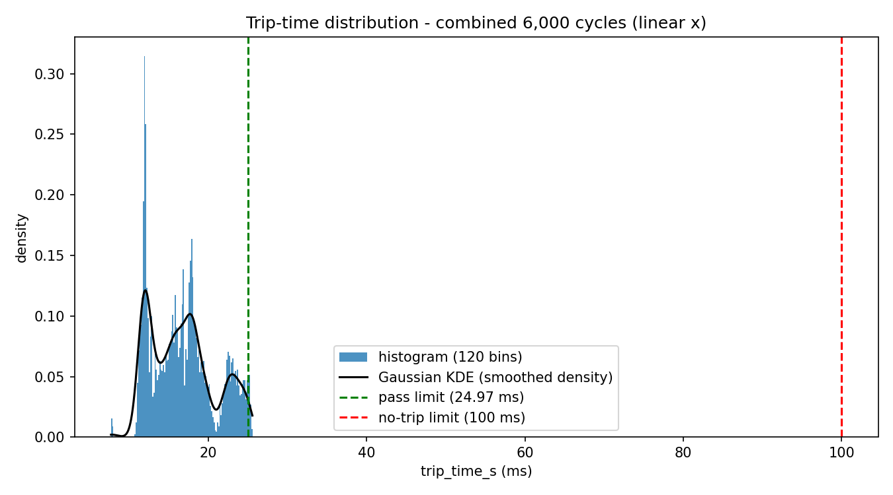
*Trip-time histogram, linear scale, with a smoothed density overlay (§5.2) — the three-peak structure is visible here.*

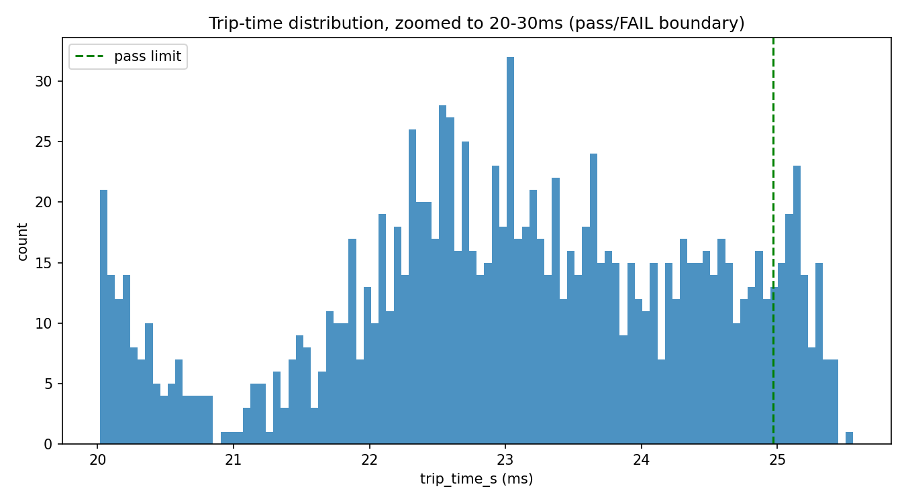
*Trip-time histogram, zoomed to the 20–30 ms pass/fail boundary region (§5.3).*

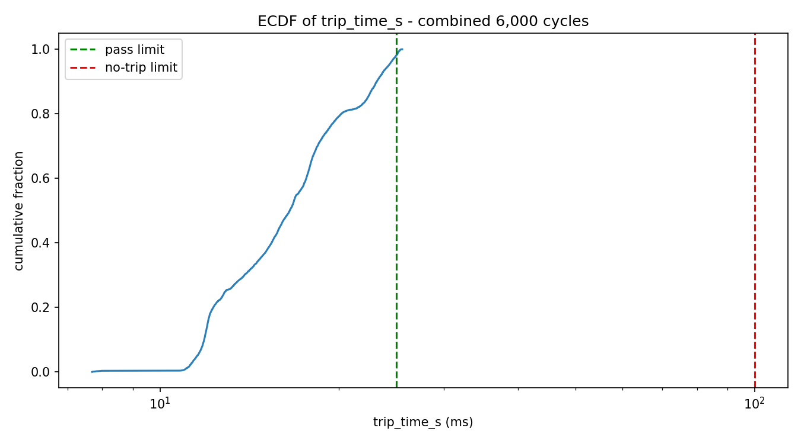
*Trip-time empirical cumulative distribution, log scale.*

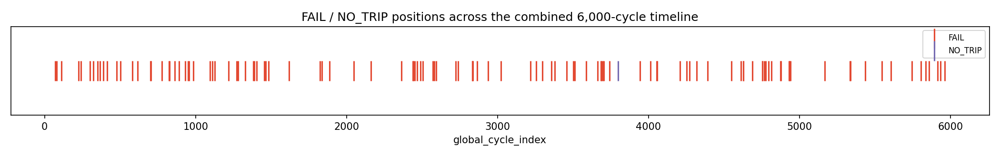
*Verdict timeline strip, marking every FAIL and the single NO_TRIP across the combined 6,000-cycle sequence (§5.1, §5.5).*

**Timeline plots**

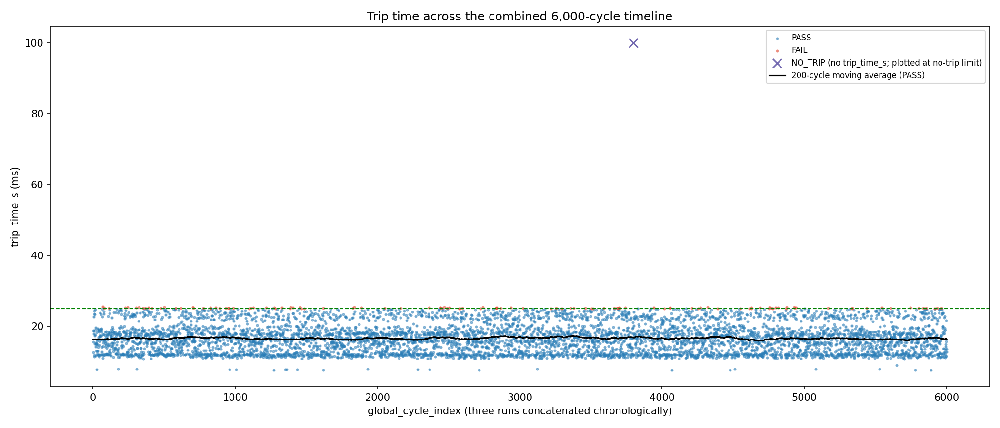
*Trip time vs. combined cycle index, with a 200-cycle moving average, by verdict (§5.2).*

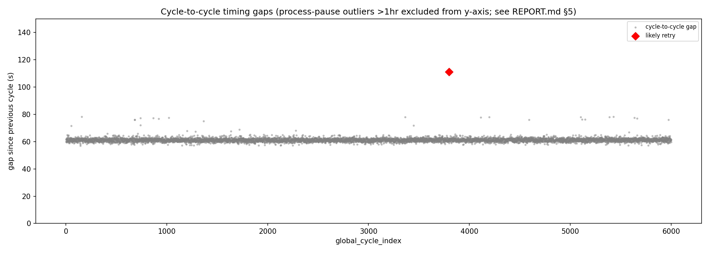
*Cycle-to-cycle timing-gap timeline, with the reconstructed retry event and process pauses marked (§6, §8.1).*

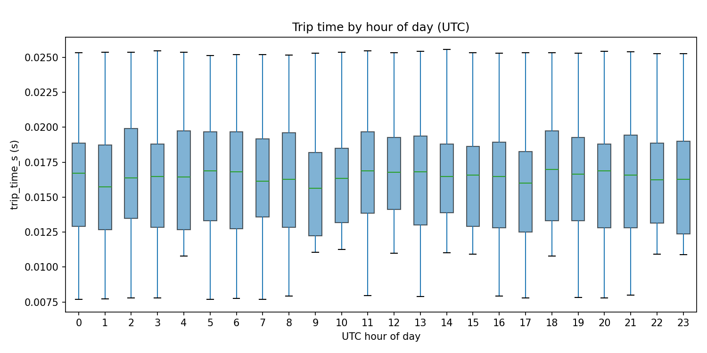
*Trip time and pass rate by hour of day (§8.3).*

**Correlation plots**

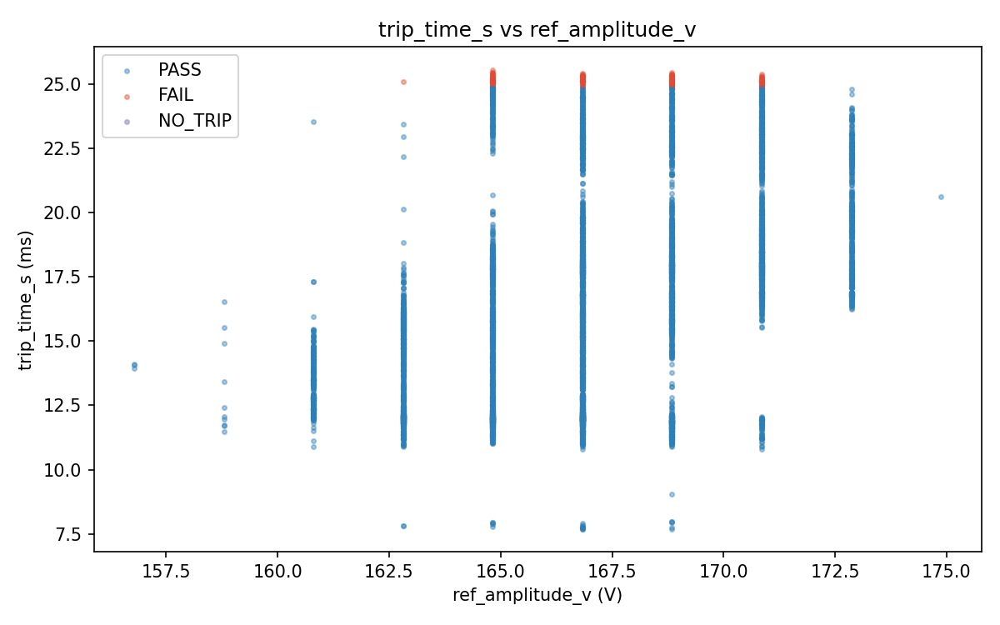
*Trip time vs. waveform reference amplitude, by verdict (§8.3).*

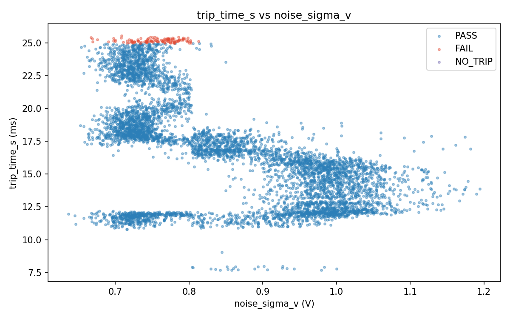
*Trip time vs. waveform noise level, by verdict (§8.3).*

**Cross-validation plot**

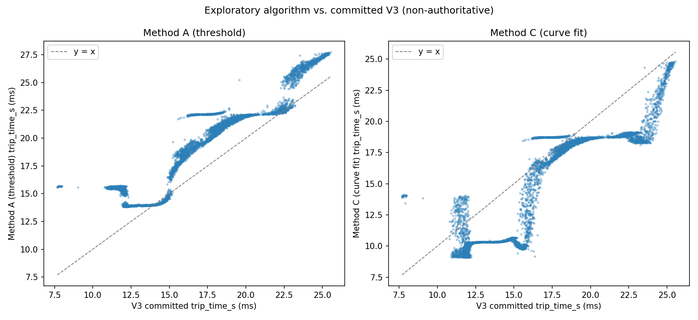
*Alternative-method trip time vs. production-algorithm trip time, threshold-based and curve-fit methods side by side, against the y = x identity line (§7.2–§7.3) — the banded/stepped structure discussed in §7.3 is visible here.*

**Representative waveforms**

Each plot below is loaded through the production waveform loader (`ccid.analysis.load_waveform` — the same preamble-based scaling and time-base recovery code the sequencer itself uses, not a reimplementation) and shows the same $t_0$/$t_{\text{end}}$/threshold values the analysis algorithm actually computed for that cycle, read from the committed record rather than recomputed. Each cycle shown is the one of its verdict closest to that verdict's own median trip time in the combined dataset — a typical example, not a boundary extreme (§5.3 already covers the boundary cases numerically).

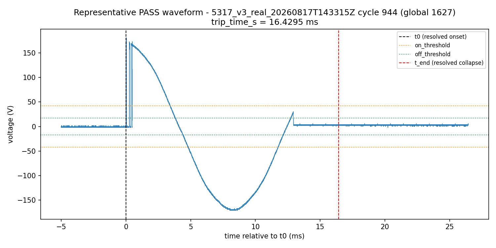
*Representative PASS waveform — `5317_v3_real` cycle 944 (global 1,627), trip_time_s = 16.4295 ms. The envelope collapses cleanly below `off_threshold` well before the pass limit.*

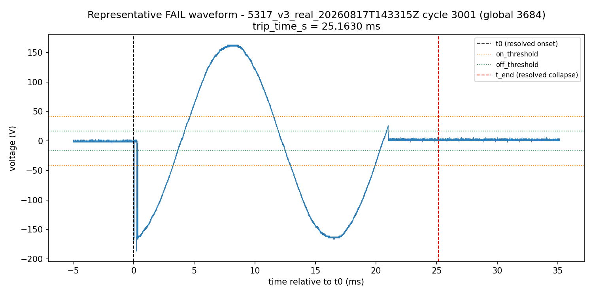
*Representative FAIL waveform — `5317_v3_real` cycle 3,001 (global 3,684), trip_time_s = 25.1630 ms. Visually similar in shape to the PASS example; the collapse simply lands slightly past the 24.97 ms line, consistent with §5.3's finding that every FAIL in this campaign was a clearing that took slightly, not dramatically, longer than the pass threshold allows.*

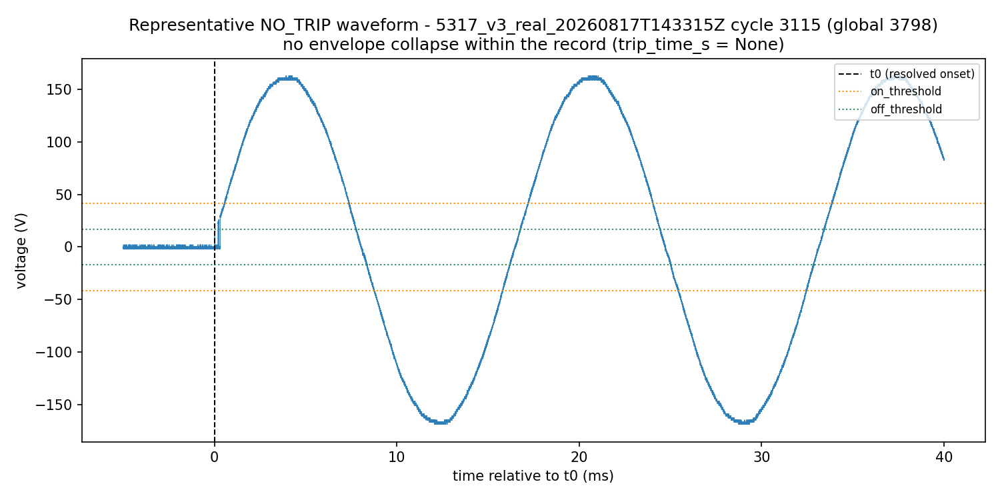
*The single NO_TRIP waveform — `5317_v3_real` cycle 3,115 (global 3,798). Sustained AC conduction continues across multiple full mains cycles past $t_0$ with no envelope collapse anywhere in the record (§5.5).*
